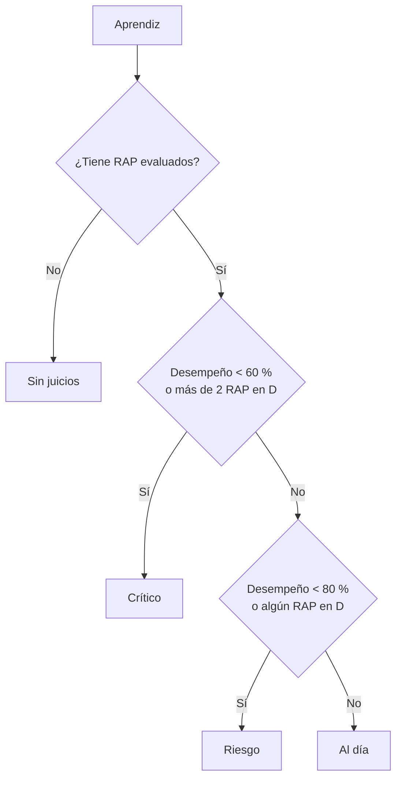

# Analítica por rol

**Sistema de Seguimiento de Proyectos Formativos — SENA** · versión 3.2

Qué cifras ve cada rol, cómo se calculan y de dónde salen. Cubre el **RF04** (panel de progreso individual y grupal) y el **RF05** (reportes por instructor, ficha y competencia), con la exportación del **RNF03**.

---

## 1. Principios

1. **Calculado al leer.** Ninguna cifra se guarda precalculada: cada panel, ficha o reporte la obtiene con una consulta sobre los juicios, las matrículas, las actividades y los planes en el momento. Antes existían columnas como `fichas.cumplimiento_porcentaje` que nadie recalculaba y que dos módulos escribían con fórmulas distintas; se eliminaron (migración `0018`).
2. **Una sola definición.** Desempeño, avance y semáforo se definen una vez (`Core\Support\Semaforo`, `FichaModel::INDICADORES`, `AnaliticaModel`) y se usan igual en paneles, fichas, expediente y reportes. Las pruebas comprueban que las cifras cuadran (el semáforo suma los aprendices en formación; A + D + pendientes = total) y que la regla del semáforo da lo mismo en SQL que en PHP.
3. **Acotado por rol en la consulta.** El alcance se aplica en el `WHERE` de cada consulta, no filtrando después:

| Rol | Alcance |
|---|---|
| Coordinador | Todo el centro. |
| Instructor | Fichas en las que tiene autoridad: líder, competencia asignada o seguimiento de etapa práctica (`InstructorAccessService::sqlFichasDelInstructor()`). Su carga personal usa la regla fina por RAP (`sqlCondicionAcceso()`). |
| Aprendiz | Sus propios registros; como referencia, el promedio de su ficha (solo la cifra agregada, nunca datos de compañeros). |

---

## 2. Definiciones

| Indicador | Fórmula | Qué responde |
|---|---|---|
| **Aprendices en formación** | Estado `matriculado`, `suspendido` o `etapa_practica` | ¿A cuántos estamos formando? |
| **Desempeño** | RAP en **A** ÷ RAP evaluados (**A + D**) × 100 | De lo que ya se evaluó, ¿cuánto se aprobó? |
| **Avance de RAP** | RAP en **A** ÷ total de RAP del programa × 100 | ¿Cuánto le falta para terminar? |
| **Avance del proyecto** | Promedio del avance de las actividades (completada = 100 %), sin las canceladas | ¿Cómo va el proyecto formativo frente a su cronograma? |
| **Deserción** | Desertados ÷ total de aprendices del alcance × 100 | ¿Cuántos abandonaron? |
| **Planes vigentes / vencidos** | Planes `abierto` o `en_curso`; vencido si además la fecha límite ya pasó | ¿Qué nivelación está en marcha o atrasada? |
| **D sin plan** | Juicios en D sin plan de mejoramiento vigente | ¿Qué no aprobados nadie está atendiendo? |

Detalles que importan:

- **Desempeño y avance son distintos a propósito.** Una ficha que empieza tiene avance bajo (le falta casi todo) pero puede tener desempeño alto (aprobó todo lo evaluado). Por eso el semáforo se aplica solo al desempeño: aplicarlo al avance marcaba como «crítica» a toda ficha nueva.
- **Sin juicios no es crítico.** Si aún no hay RAP evaluados, el desempeño es «—» y el semáforo dice «Sin juicios».
- **Qué aprendices cuentan.** En los paneles, los que están en formación. En el listado y detalle de fichas, todos salvo los desertados (incluye egresados, para que una ficha en cierre siga mostrando su resultado final).

## 3. Semáforo de riesgo académico

`Core\Support\Semaforo` — la misma regla en PHP y en SQL (`Semaforo::sqlAprendiz()`), para contar en la base sin traer cada aprendiz a memoria.

| Estado | Aprendiz | Ficha o grupo (sobre el desempeño agregado) |
|---|---|---|
| Crítico | < 60 % o más de 2 D | < 60 % |
| Riesgo | < 80 % o algún D | 60 – 79,9 % |
| Al día | ≥ 80 % y sin D | ≥ 80 % |
| Sin juicios | Nada evaluado | Nada evaluado |

Los umbrales son constantes de `Semaforo` (`UMBRAL_RIESGO = 60`, `UMBRAL_AL_DIA = 80`, `MAX_D_RIESGO = 2`) y se muestran en **Configuración**. En el Excel de los reportes las celdas del semáforo salen coloreadas con la misma escala.

---

## 4. Panel de coordinación

`DashboardController::coordinador()` · vista `modules/dashboard/views/coordinador.view.php`

| Bloque | Contenido | Método |
|---|---|---|
| Cifras principales | Fichas activas (no en cierre), aprendices en formación, instructores activos, desempeño con semáforo, avance de RAP, deserción | `AnaliticaModel::resumen()` |
| Atención | Planes vigentes y vencidos, evidencias por revisar, RAP pendientes | `resumen()` |
| Semáforo de aprendices | Gráfico de dona: críticos, en riesgo, al día, sin juicios | `semaforo()` |
| Juicios por semana | Barras A y D de las últimas 12 semanas, según el historial (fecha real de cada juicio) | `tendencia()` |
| Por programa | Fichas, aprendices, desempeño y avance de cada programa | `porPrograma()` |
| Carga de instructores | Fichas que lidera, pendientes por calificar, D a su cargo, juicios emitidos en 30 días, planes vigentes y vencidos | `porInstructor()` |
| Competencias críticas | Mayor proporción de D sobre lo evaluado (mínimo 5 juicios) | `competenciasCriticas()` |
| Fichas con menor desempeño | Las 8 más bajas; sin juicios al final | `FichaModel::listar()` |
| Aprendices en riesgo | Críticos y en riesgo, los peores primero | `aprendicesEnRiesgo()` |
| Actividades por vencer | Vencidas o que vencen en 14 días | `actividadesProximas()` |

## 5. Panel del instructor

`DashboardController::instructor()` · vista `instructor.view.php`

| Bloque | Contenido | Método |
|---|---|---|
| Mi carga | RAP por calificar, D sin plan, planes vencidos, evidencias por revisar. Solo lo que **él** califica o revisa. | `cargaInstructor()` |
| Mis fichas | Desempeño, avance y deserción del conjunto; tarjeta por ficha con su semáforo | `resumen()`, `FichaModel::listar()` |
| Semáforo y tendencia | Igual que coordinación, acotado a sus fichas | `semaforo()`, `tendencia()` |
| Competencias críticas | De sus fichas | `competenciasCriticas()` |
| Mis aprendices en riesgo | Con enlace al expediente | `aprendicesEnRiesgo()` |
| Actividades por vencer | De sus fichas | `actividadesProximas()` |

Cada tarjeta de «Mi carga» enlaza al listado ya filtrado (juicios pendientes, D sin plan, planes vencidos, evidencias por revisar).

## 6. Panel del aprendiz

`DashboardController::aprendiz()` · vista `aprendiz.view.php`

| Bloque | Contenido |
|---|---|
| Mi progreso | Avance de RAP frente al **promedio de su ficha**, desempeño con semáforo, RAP en A, D y pendientes |
| Por competencia | Barra de avance de cada competencia (A sobre total) con sus D |
| Mis planes | Planes vigentes con días restantes o vencidos |
| Próximas actividades | Del proyecto de su ficha, 21 días |
| Última retroalimentación | Las 3 más recientes (solo públicas) |

## 7. Indicadores fuera de los paneles

| Pantalla | Cifras |
|---|---|
| **Fichas** (listado y detalle) | Aprendices activos, A, D, desempeño con semáforo, avance de RAP, avance del proyecto, planes abiertos; en el detalle, la misma fila por aprendiz |
| **Seguimiento** (expediente) | Desempeño, semáforo y avance del aprendiz; RAP por competencia |
| **Evaluaciones** | A, D y pendientes del filtro aplicado (cuadran con el total del listado) |
| **Mejoramiento** | Vigentes, vencidos, cumplidos y D sin plan |
| **Evidencias** | Aviso de evidencias por revisar, con enlace al listado filtrado |
| **Fases** | Avance de cada fase del proyecto |

---

## 8. Reportes (RF05)

`/reportes` · `Core\Services\ReportesService` · disponible para coordinación e instructores.

Cada reporte se define **una vez** (título, encabezados, filas, anchos y estilos) y se entrega en tres formatos:

| Formato | Detalle |
|---|---|
| **Excel (.xlsx)** | Archivo Office Open XML real, con encabezado fijo, anchos de columna y celdas de semáforo y juicio coloreadas |
| **CSV** | UTF-8 con BOM y `;` (abre bien en Excel en español); celdas que empiezan por `= + - @` neutralizadas |
| **PDF** | Encabezado institucional (nombre del sistema y centro desde Configuración), tabla paginada, generado con dompdf |

| Reporte | Contenido | Parámetros | Alcance del instructor |
|---|---|---|---|
| Juicios de una ficha | Cada RAP de cada aprendiz: juicio, fecha, quién califica | Ficha | Solo fichas donde tiene autoridad |
| Resumen por ficha | Aprendices, A, D, desempeño, semáforo, avance de RAP y del proyecto, planes | — | Sus fichas |
| Cumplimiento por instructor | Por responsable, ficha y competencia: total, A, D, pendientes, desempeño, avance | — | Lo que él califica |
| Cumplimiento por competencia | Por competencia: fichas, aprendices, A, D, pendientes, desempeño, avance | — | Lo que él califica |
| Aprendices en riesgo | Críticos y en riesgo con sus D y planes vigentes | — | Sus fichas |
| Historial de cambios de juicio | Fecha, ficha, aprendiz, RAP, anterior, nuevo, motivo, quién (RNF02) | Desde / hasta (máx. 1 año; por defecto 90 días) | Juicios de sus fichas |

Toda descarga queda en la bitácora (acción `exportar`).

### Exportaciones de listados

Además de los reportes, cada listado exporta lo que muestra, con sus filtros: usuarios, fichas (listado y detalle), matrículas, juicios, planes de mejoramiento y bitácora (`Core\Exportacion\Exportador`).

---

## 9. Rendimiento

- Índices compuestos para las consultas de los paneles: aprendices por ficha y estado, evaluaciones por ficha y concepto (migración `0013`); planes por ficha, aprendiz e instructor con estado (migración `0016`).
- El semáforo se cuenta en SQL agrupando por aprendiz, no cargando aprendices en PHP.
- Los límites de cada bloque (8 fichas, 10 aprendices, 12 semanas…) se acotan también en el modelo (`min(..., 50)`), de modo que un parámetro manipulado no genera consultas enormes.

## 10. Pruebas

| Prueba | Qué garantiza |
|---|---|
| `SemaforoTest` | Bordes del semáforo: 59,9 / 60 / 79,9 / 80 %, 0 a 3 D, sin juicios; ficha y aprendiz |
| `ConsultasDeModelosTest` | El semáforo suma los aprendices en formación; A + D + pendientes = total; la regla en SQL coincide con la de PHP; el instructor ajeno ve cero; el progreso del aprendiz suma solo sus RAP |
| `AuditoriaYReportesTest` | Cada reporte sale en PDF y en Excel; en el Excel la D sale como crítica y la A como al día |
| `SemaforoReporteTest` | Colores por umbral en los reportes y neutralización de fórmulas en las celdas |
| `AutorizacionTest` | Alcance de los reportes por rol; un instructor sin fichas obtiene reportes vacíos |
