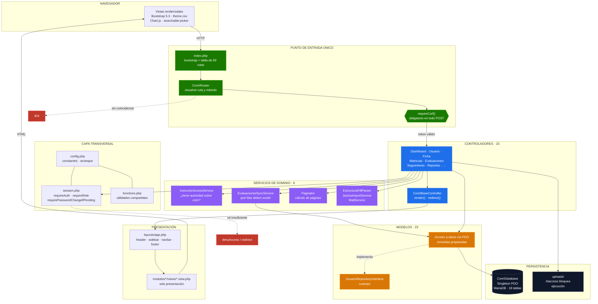
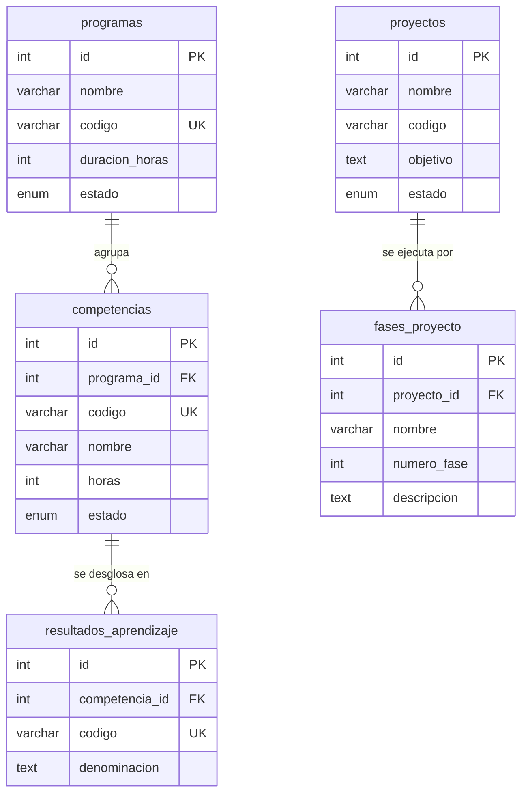
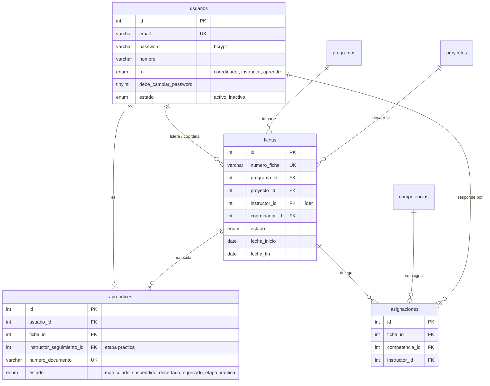
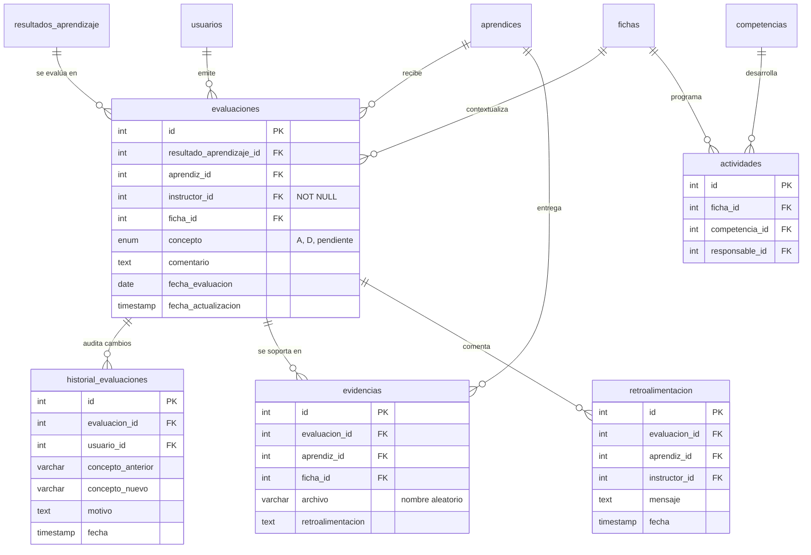
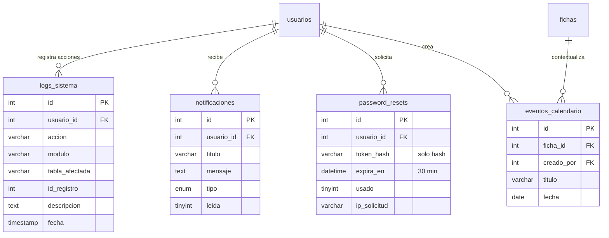
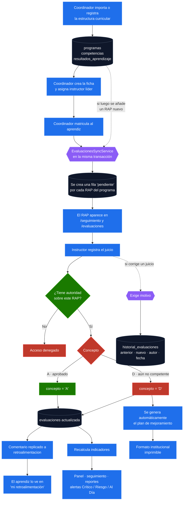

# Arquitectura del Sistema

**Sistema de Seguimiento de Proyectos Formativos — SENA**

| | |
|---|---|
| **Versión** | 2.0 |
| **Fecha** | 11 de agosto de 2026 |
| **Entorno** | PHP 8.2.12 · MariaDB 10.4.32 · Apache (XAMPP en desarrollo, VPS en producción) |

---

## 1. Visión general

El sistema es una aplicación web monolítica con separación estricta en capas, **sin framework**. La decisión de no usar framework fue deliberada: el proyecto es formativo y se buscaba que la arquitectura fuera legible y explicable línea a línea, sin la abstracción de un Laravel o un Symfony de por medio.

Eso obliga a ser disciplinado en la separación, porque nada la impone por nosotros. Los cuatro principios que sostienen el diseño:

1. **Punto de entrada único.** Todas las peticiones pasan por `index.php`, que enruta, valida CSRF y delega. No hay archivos PHP sueltos accesibles que ejecuten lógica.
2. **El controlador orquesta, el modelo sabe de datos.** Ningún SQL vive en una vista; ninguna vista se consulta a sí misma.
3. **La regla de negocio que se repite se extrae a un servicio.** Cuando una misma regla aparecía en dos sitios, se convirtió en un servicio con una sola implementación.
4. **La autorización se comprueba en el servidor, siempre.** Ocultar un enlace no es una medida de seguridad.

### Cifras del sistema

| Métrica | Valor |
|---|---|
| Módulos funcionales | 22 |
| Controladores | 23 |
| Modelos | 23 |
| Servicios de dominio | 6 |
| Vistas | 36 |
| Rutas registradas | 69 |
| Tablas en base de datos | 18 |
| Migraciones versionadas | 8 |
| Líneas de PHP (sin dependencias) | ≈ 24.300 |

---

## 2. Diagrama de componentes

Muestra cómo viaja una petición y qué capa puede hablar con qué. Las flechas marcan dirección de dependencia: **una capa nunca conoce a la de arriba**.



### Por qué los servicios existen

No son una capa decorativa. Cada uno nació de un problema concreto:

| Servicio | Problema que resuelve |
|---|---|
| `InstructorAccessService` | La regla «¿este instructor manda sobre este aprendiz?» estaba escrita tres veces con criterios distintos. La retroalimentación solo reconocía al instructor líder e ignoraba las asignaciones por competencia. |
| `EvaluacionesSyncService` | La regla «cada aprendiz debe tener una fila por cada RAP de su programa» solo se aplicaba al matricular. Un RAP creado después no llegaba a nadie. |
| `Paginator` | Cada listado grande resolvía el volumen con un `LIMIT` fijo distinto, que recortaba datos sin avisar. |
| `EstructuraPdfParser` | Eran 360 líneas de análisis de PDF incrustadas dentro de un método de controlador. |
| `JuiciosImportService` | Interpretación del reporte institucional en Excel, con su previsualización. |
| `MailService` | Envío SMTP real del correo de recuperación. |

---

## 3. Modelo de datos

18 tablas con 33 relaciones de integridad referencial. Se presenta por dominios para que sea legible; la vista completa está al final.

### 3.1 Estructura curricular

Define **qué** se enseña. Es la columna vertebral: sin ella no hay nada que evaluar.



> Los códigos de `competencias` y `resultados_aprendizaje` llevan restricción de unicidad, y las claves foráneas son `RESTRICT`: no se puede borrar un programa que tenga competencias colgando. Antes eran `CASCADE`, lo que significaba que borrar un programa arrastraba en silencio sus competencias, sus RAP y **todos los juicios evaluativos asociados**.

### 3.2 Personas, grupos y responsabilidad

Define **quién** participa y **de qué responde**.



> `asignaciones` es la tabla que hace posible el control de acceso fino: un instructor puede evaluar una competencia concreta de una ficha concreta sin ser el líder de esa ficha.

### 3.3 Evaluación y trazabilidad

El núcleo del sistema. Cada fila de `evaluaciones` es el juicio de **un aprendiz sobre un RAP**, con unicidad garantizada.



**Restricción clave:** `UNIQUE(resultado_aprendizaje_id, aprendiz_id)`. Garantiza un único juicio vigente por RAP y aprendiz, y es la que permite que la sincronización de evaluaciones sea idempotente.

**Sobre `concepto`:** el `ENUM('A','D','pendiente')` refleja la normativa SENA — **A** (aprobado) y **D** (aún no competente) — más el estado inicial. No existen valores como «aprobado» o «en proceso» en base de datos, aunque la interfaz los muestre con esas etiquetas.

### 3.4 Soporte y trazabilidad del sistema



---

## 4. Casos de uso por rol

Cada rol ve un sistema distinto. El diagrama muestra qué puede hacer cada uno y **dónde se comparte funcionalidad con alcance diferente**.

```mermaid
graph LR
    COORD(["👤 COORDINADOR"])
    INST(["👤 INSTRUCTOR"])
    APR(["👤 APRENDIZ"])

    subgraph admin["ADMINISTRACIÓN · solo coordinador"]
        U1["Gestionar usuarios"]
        U2["Importar usuarios"]
        U3["Configurar sistema"]
        U4["Consultar auditoría"]
    end

    subgraph curric["ESTRUCTURA CURRICULAR · solo coordinador"]
        U5["Gestionar programas"]
        U6["Gestionar competencias y RAP"]
        U7["Importar estructura desde PDF"]
        U8["Gestionar fichas"]
        U9["Matricular aprendices"]
        U10["Asignar instructores"]
    end

    subgraph eval["EVALUACIÓN"]
        U11["Registrar juicio A/D"]
        U12["Modificar juicio con motivo"]
        U13["Importar juicios desde Excel"]
        U14["Calificar evidencias"]
        U15["Dar retroalimentación"]
    end

    subgraph segui["SEGUIMIENTO"]
        U16["Ver rendimiento por aprendiz"]
        U17["Generar plan de mejoramiento"]
        U18["Consultar reportes y exportar"]
    end

    subgraph propio["ÁMBITO DEL APRENDIZ"]
        U19["Consultar mi avance"]
        U20["Subir mis evidencias"]
        U21["Ver mi retroalimentación"]
        U22["Ver mis planes de mejora"]
    end

    subgraph comun["COMÚN A TODOS"]
        U23["Iniciar sesión"]
        U24["Recuperar contraseña"]
        U25["Editar mi perfil"]
        U26["Consultar calendario"]
        U27["Ver mi panel de indicadores"]
    end

    COORD --> U1 & U2 & U3 & U4
    COORD --> U5 & U6 & U7 & U8 & U9 & U10
    COORD --> U11 & U12 & U13
    COORD --> U16 & U17 & U18

    INST --> U6
    INST --> U11 & U12 & U14 & U15
    INST --> U16 & U17 & U18

    APR --> U19 & U20 & U21 & U22

    COORD --> U23 & U25 & U26 & U27
    INST --> U23 & U25 & U26 & U27
    APR --> U23 & U25 & U26 & U27
    COORD -.-> U24
    INST -.-> U24
    APR -.-> U24

    classDef actor fill:#1a7a00,stroke:#39A900,color:#fff
    class COORD,INST,APR actor
```



> **Alcance, no solo permiso.** El coordinador y el instructor comparten los casos de evaluación y seguimiento, pero **no ven lo mismo**: el instructor está limitado a sus fichas, a las competencias que tiene asignadas y a los aprendices de los que hace seguimiento. Ese recorte se resuelve dentro de la consulta SQL, no filtrando en el cliente, y por eso también los totales y contadores que ve son los suyos.

---

## 5. Flujo del proceso de evaluación

Es el proceso central del sistema, de principio a fin.



**Los dos puntos que hacen que el proceso no tenga huecos:**

1. **La flecha de vuelta desde la estructura curricular hacia el servicio de sincronización.** Sin ella, un RAP creado después de la matrícula no le llegaba a ningún aprendiz existente: no aparecía en pantalla y era imposible de calificar. Este fue un fallo real, con 256 registros perdidos en 31 aprendices.
2. **La bifurcación hacia `historial_evaluaciones`.** Corregir una nota exige motivo y deja constancia del valor anterior, el nuevo, el autor y la fecha. Es lo que convierte el sistema en auditable.

---

## 6. Patrones y decisiones de diseño

### 6.1 Vista autocontenida

Cada archivo de vista se puede pedir directamente o ser incluido por el layout. Comprueba si ya está dentro del layout antes de solicitarlo, evitando la doble renderización. El layout usa `require` y no `require_once` precisamente porque el archivo ya fue incluido una vez.

### 6.2 Redirección después de escribir (PRG)

Toda operación de escritura termina en una redirección, no en un renderizado. Así, recargar la página no repite la operación. Los casos que deben mostrar un dato de un solo uso —las contraseñas temporales de una importación— lo pasan por sesión, no por mensaje simple, porque tienen que sobrevivir a la redirección y mostrarse exactamente una vez.

### 6.3 Consulta compartida entre listado y conteo

Los modelos que paginan tienen un método privado `construirConsulta()` que devuelve el `FROM` + `WHERE` con sus parámetros, y **tanto el listado como el `COUNT` lo usan**. Si se construyeran por separado, bastaría añadir un filtro a uno y no al otro para que el total dejara de corresponder con las filas mostradas.

### 6.4 Sistema de diseño con pares de tokens

`theme.css` define los colores semánticos en **pares**: `--danger` para rellenos (con letra blanca encima) y `--danger-text` para texto sobre superficie. En tema claro coinciden; en oscuro no pueden, porque un rojo oscuro sobre fondo rojo oscuro es ilegible, pero aclarar el relleno rompería los botones.

Además, `theme.css` remapea las variables `--bs-*` de Bootstrap a los tokens del tema, de modo que los componentes de Bootstrap respetan claro/oscuro sin parchear vista por vista.

### 6.5 Enfoque móvil

Un patrón `.page-header` único para las 29 vistas, con capa móvil a 640 px. Se corrigieron dos defectos que dejaban contenido **inalcanzable**, no solo apretado: contenedores de tabla que recortaban las columnas sin permitir desplazamiento, y una barra superior donde la miga de pan empujaba los controles fuera de la pantalla.

---

## 7. Seguridad

| Control | Implementación |
|---|---|
| Contraseñas | `bcrypt` mediante `password_hash()` |
| Sesión | Regeneración de identificador y limpieza en cada acceso |
| CSRF | Validación obligatoria en el enrutador para todo `POST`, con token por pestaña |
| Inyección SQL | Consultas preparadas en el 100 % de los accesos (`ATTR_EMULATE_PREPARES => false`) |
| XSS | `htmlspecialchars()` en la salida, incluidos los `json_encode()` dentro de atributos HTML; lista blanca de caracteres en las importaciones |
| Autorización | Exigencia de rol en el constructor del controlador más comprobación de propiedad del recurso |
| Subida de archivos | Validación de tipo real con `finfo`, nombre aleatorio y `.htaccess` que impide ejecutar código en `uploads/` |
| Contraseñas temporales | Aleatorias por usuario, con cambio forzado en el primer acceso |
| Recuperación | Token de un solo uso, 30 minutos de vigencia, almacenado como *hash* |
| Borrado | Lógico (`estado = inactivo` / `desertado`), preservando historial y auditoría |
| Integridad referencial | 33 claves foráneas con `RESTRICT` en las relaciones críticas |
| Trazabilidad | Bitácora en `logs_sistema` e historial de cambios de juicio |

### Brechas conocidas

Se declaran de forma explícita para no sostener afirmaciones falsas:

| Brecha | Estado |
|---|---|
| Bloqueo por intentos fallidos de acceso | No implementado. Documentación previa del proyecto lo daba por hecho; se verificó que no existe. |
| Disparadores de notificaciones | La infraestructura está completa, pero ningún evento de negocio genera avisos todavía. |
| Etiquetas de formulario | Asociadas en los formularios de mayor tráfico; queda pendiente el barrido completo. |

---

## 8. Estructura de directorios

```text
proyecto_sena/
├── index.php                  Punto de entrada único: bootstrap + 69 rutas
├── login.php · recover.php    Acceso y recuperación (fuera del enrutador)
│
├── core/                      Núcleo de la aplicación (PSR-4: Core\)
│   ├── Router.php             Resuelve ruta, exige CSRF, delega
│   ├── Database.php           Singleton PDO
│   ├── BaseController.php     render() y redirect()
│   ├── XlsxParser.php         Lectura de Excel
│   ├── Controllers/           23 controladores
│   ├── Models/                23 modelos
│   ├── Services/              6 servicios de dominio
│   └── Interfaces/            Contratos de repositorio
│
├── config/
│   ├── app.php                Configuración de aplicación
│   └── navigation.php         Menú por rol (fuente de la restricción visual)
│
├── includes/
│   ├── config.php             Constantes y arranque
│   ├── session.php            requireAuth · requireRole · CSRF
│   ├── auth.php               Inicio y cierre de sesión
│   ├── functions.php          Utilidades compartidas
│   └── api_notificaciones.php Extremo JSON de notificaciones
│
├── modules/                   22 módulos · solo vistas + stub de redirección
│   └── <modulo>/
│       ├── index.php          Redirección al enrutador
│       └── views/*.view.php   Presentación
│
├── layouts/                   header · app · footer
├── components/                sidebar · navbar · paginacion · modales
│
├── assets/
│   ├── css/                   theme.css (sistema de diseño) · picker.css · login-nano.css
│   ├── js/                    app.js · searchable-picker.js · módulos
│   └── img/
│
├── migrations/                8 migraciones versionadas
├── uploads/                   Evidencias · .htaccess bloquea ejecución
├── logs/                      .htaccess bloquea acceso
├── docs/                      Esta documentación
└── vendor/                    PHPMailer · SimpleXLS
```

---

## 9. Despliegue

| Elemento | Desarrollo | Producción |
|---|---|---|
| Servidor | XAMPP (Apache + PHP 8.2 + MariaDB) sobre Windows 11 | VPS con Apache |
| Despliegue | Local | Automático por *webhook* al fusionar en `main` |
| Control de versiones | Git · GitHub | Rama `main` |

### Requisitos del servidor

- PHP ≥ 8.1 con `pdo_mysql`, `finfo`, `mbstring` y `openssl`.
- MariaDB ≥ 10.4 o MySQL ≥ 5.7.
- Apache con `AllowOverride All`, necesario para que los `.htaccess` de `uploads/` y `logs/` surtan efecto.
- Composer para instalar PHPMailer y SimpleXLS.

### Puesta en marcha

```bash
git clone https://github.com/Manuel151025/proyecto_sena.git
cd proyecto_sena
composer install
# Crear la base y cargar el esquema
mysql -u root -p sena_seguimiento < sena_seguimiento.sql
# Configurar credenciales y APP_HOST
cp .env.example .env    # editar
# Aplicar migraciones
php migrations/add_password_change_required.php
php migrations/fix_cascade_to_restrict.php
php migrations/add_unique_codigos.php
php migrations/backfill_evaluaciones_pendientes.php
```

> **Importante.** El despliegue automático actualiza el código, **no la base de datos**. Las migraciones se ejecutan a mano. `backfill_evaluaciones_pendientes.php` es idempotente y admite `--dry-run` para comprobar antes de aplicar.

---

## 10. Verificación y calidad

| Aspecto | Cómo se verificó |
|---|---|
| Interfaz móvil | Navegador real (Edge) a 390 px, tema claro y oscuro, 9 pantallas: ninguna con desplazamiento horizontal |
| Paginación | 14 pruebas funcionales automatizadas: navegación, filtros que persisten, página fuera de rango, y conteo cuadrando con la suma de páginas en los cuatro roles |
| Sincronización de evaluaciones | Probada en transacción revertida: detecta y crea exactamente lo que falta, es idempotente y no altera juicios ya emitidos |
| Alcance por rol | Verificado que el conteo de juicios coincide con lo realmente visible para coordinador, dos instructores distintos y un aprendiz |
| Integridad de datos | Comprobado que el rellenado de registros no modificó ninguno de los 987 juicios ya emitidos |

---

## 11. Documentos relacionados

| Documento | Contenido |
|---|---|
| [`HISTORIAS_USUARIO.md`](HISTORIAS_USUARIO.md) | 34 historias con criterios de aceptación y trazabilidad al código |
| [`../README.md`](../README.md) | Presentación del proyecto, instalación y estado de los módulos |

---

*Documento elaborado a partir del código en producción. Las cifras se obtuvieron por inspección directa del repositorio y de la base de datos.*
