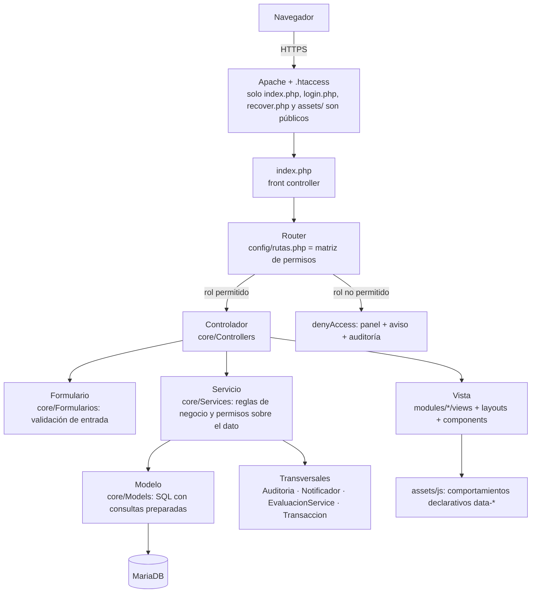
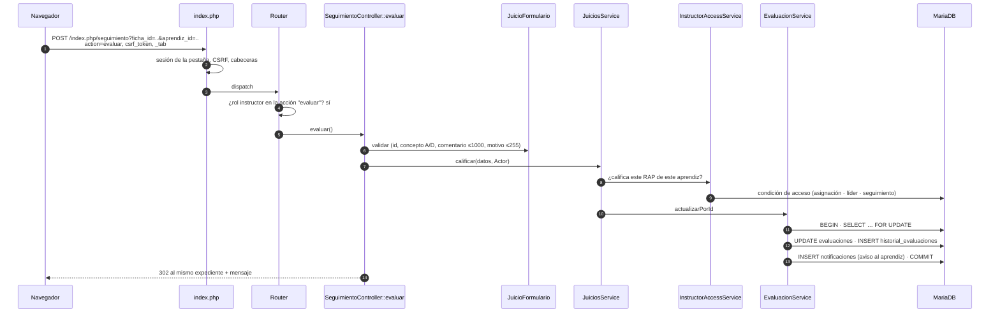
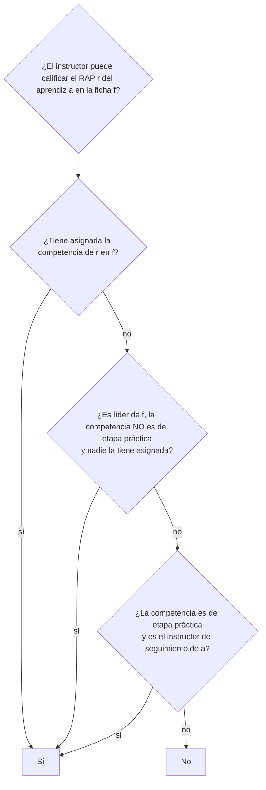
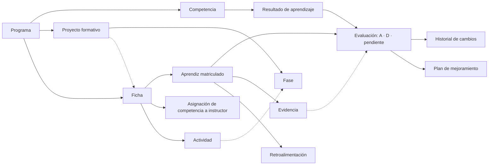
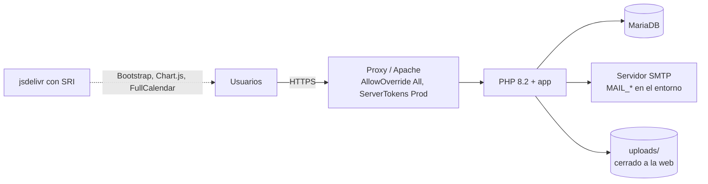

# Arquitectura

**Sistema de Seguimiento de Proyectos Formativos — SENA, Centro Tecnológico de la Amazonia**

| | |
|---|---|
| Versión del documento | 3.0 (septiembre de 2026) |
| Público | Equipo de desarrollo, instructores evaluadores y quien mantenga el sistema |
| Documentos relacionados | [Flujos](FLUJOS.md) · [Datos](DATOS.md) · [Rutas y permisos](RUTAS_Y_PERMISOS.md) · [Seguridad](SEGURIDAD.md) · [Analítica](ANALITICA.md) · [Despliegue](DESPLIEGUE.md) · [Pruebas](PRUEBAS.md) |

---

## 1. Visión general

Aplicación web en PHP 8.2 sin framework, con arquitectura en capas sobre un único punto de entrada (`index.php`). Da seguimiento al proyecto formativo de cada ficha: estructura curricular (programas, competencias y RAP), fichas y matrículas, proyecto formativo con fases y actividades, juicios evaluativos A/D con historial, evidencias, retroalimentación, planes de mejoramiento, analítica por rol, reportes y auditoría.

| Cifra | Valor |
|---|---|
| Tablas | 22 ([diccionario](DATOS.md)) |
| Migraciones versionadas | 18 |
| Destinos del enrutador (pantallas, descargas y acciones) | 111 ([tabla](RUTAS_Y_PERMISOS.md)) |
| Controladores / servicios / modelos / formularios | 25 / 26 / 22 / 12 |
| Pruebas automáticas (PHPUnit) | 594, en local y en integración continua |

### Tecnologías

| Capa | Tecnología |
|---|---|
| Servidor | Apache 2.4 con `mod_rewrite` y `mod_headers`; PHP 8.2 (PDO, mbstring, zip, fileinfo) |
| Base de datos | MariaDB 10.4+ / MySQL 8, InnoDB, `utf8mb4`, `sql_mode` estricto |
| Interfaz | HTML5 + Bootstrap 5.3 + Bootstrap Icons, Chart.js 4 (gráficos), FullCalendar 6 (calendario); CSS propio con modo claro/oscuro |
| Bibliotecas PHP (Composer) | dompdf (PDF), PHPMailer (correo SMTP), SimpleXLS (lectura de .xls) |
| Pruebas | PHPUnit 11; recorridos de navegador con Playwright durante el desarrollo |
| Integración continua | GitHub Actions: instala desde cero con datos de demostración y ejecuta las suites |

---

## 2. Capas y responsabilidades



| Capa | Dónde | Qué hace | Qué no hace |
|---|---|---|---|
| Punto de entrada | `index.php` | Carga configuración, sesión y cabeceras de seguridad; normaliza la ruta; responde 401 JSON a las API sin sesión. | Lógica de negocio. |
| Enrutador | `core/Router.php`, `config/rutas.php` | Decide controlador y método por `MÉTODO /ruta` y, en POST, por el campo `action`. Comprueba el **rol** de cada pantalla y de cada acción; responde 400/403/404/405 con página o JSON. | Permisos sobre datos concretos. |
| Controlador | `core/Controllers` | Lee la petición, llama al formulario y al servicio, redirige (patrón PRG) o pinta la vista. Cada acción es un método que termina en `never`. | SQL ni reglas de negocio. |
| Formulario | `core/Formularios` | Valida y normaliza la entrada con `Core\Support\Validador`: tipos, longitudes, listas cerradas, patrones, fechas. | Consultar la base. |
| Servicio | `core/Services` | Reglas del dominio y **autorización sobre el dato** (¿este instructor califica este RAP?). Transacciones, auditoría y avisos. Recibe un `Actor` (id + rol). | HTML. |
| Modelo | `core/Models` | SQL. Toda consulta es preparada; los listados se acotan por `Actor` en el propio `WHERE`. | Decidir permisos de escritura. |
| Vista | `modules/*/views`, `layouts`, `components` | HTML con escapado (`e()`), datos en `data-*` o JSON. Sin JavaScript en línea. | Consultas. |

### Por qué servicios y formularios aparte

Antes cada controlador validaba a mano, escribía SQL y decidía permisos en el mismo `index()` de cientos de líneas, con copias de la misma condición de acceso en cuatro sitios que divergían. Separar las responsabilidades permitió:

- **Una sola condición de acceso** del instructor (`InstructorAccessService::sqlCondicionAcceso()`), usada por el permiso de calificar y por todos los listados.
- **Una sola puerta de escritura del juicio** (`EvaluacionService`): transacción, bloqueo de fila, historial en cada cambio y aviso al aprendiz, venga de donde venga (pantalla de juicios, expediente, evidencias, planes, importación).
- Probar las reglas sin navegador (594 pruebas).

---

## 3. Recorrido de una petición

Ejemplo: un instructor cambia un juicio de A a D desde el expediente de seguimiento.



Si el motivo falta al cambiar un juicio emitido, `EvaluacionService` lanza `ErrorDeNegocio` y el usuario ve el mensaje; cualquier otra excepción se registra y el usuario ve una referencia (`ErrorDeNegocio::mensajeSeguro`).

---

## 4. Piezas transversales

| Pieza | Responsabilidad |
|---|---|
| `Core\Support\Actor` | Quién ejecuta (id y rol). Lo reciben servicios y modelos para acotar. |
| `Core\Support\Validador` | Validación de entrada: enteros e ids, texto con límites, patrones (nombres, personas, códigos), fechas y rangos, listas cerradas, correo, color hexadecimal, búsqueda con comodines escapados. |
| `Core\Support\ErrorDeNegocio` / `ErroresBD` | Mensajes para el usuario frente a errores internos; traducción de errores de clave duplicada o foránea a mensajes de negocio. |
| `Core\Support\Transaccion` | Abre transacción solo si no hay una abierta (PDO no anida). |
| `Core\Support\Semaforo` | Regla única del semáforo: crítico, riesgo, al día, sin juicios. La usan fichas, seguimiento, paneles y reportes (PHP y SQL). |
| `Core\Support\PoliticaContrasena` | Mínimo 8 caracteres y máximo 72 bytes (límite de bcrypt), letras y números, sin caracteres de control, sin el usuario del correo y sin las más comunes; claves temporales aleatorias que cumplen la política. |
| `Core\Support\ArchivoSubido` | Subidas seguras: errores de PHP, tamaño, lista blanca de extensiones, tipo real (finfo) y firma del archivo. |
| `Core\Support\Descarga` | Envío de archivos con permiso comprobado, `nosniff` y sandbox para lo que se abre en el navegador. |
| `Core\Support\Seguridad` | Cabeceras (CSP sin `unsafe-inline` en scripts, X-Frame-Options, Referrer-Policy, Permissions-Policy, HSTS bajo HTTPS) y sin caché en páginas autenticadas. |
| `Core\Services\Auditoria` | Bitácora: quién, qué, sobre qué registro, desde qué IP. |
| `Core\Services\Notificador` | Avisos internos; solo admite rutas internas como enlace. |
| `Core\Services\EvaluacionesSyncService` | Garantiza una evaluación pendiente por aprendiz y RAP del programa, y que cada pendiente tenga como responsable a quien la califica. |
| `Core\Importacion\*` | Importación en dos pasos (analizar con vista previa, confirmar); un `Importador` por tipo. |
| `Core\Exportacion\Exportador` | CSV (con BOM, `;` y neutralización de fórmulas) y XLSX real, con semáforo en las celdas. |
| `Core\Models\AnaliticaModel` | Indicadores de los paneles, calculados al leer y acotados por rol. |

---

## 5. Control de acceso en dos capas

1. **Por rol, en el enrutador.** Cada pantalla y cada acción declara sus roles en `config/rutas.php`. Un aprendiz que envía `action=asignar` a `/asignaciones` es rechazado antes de llegar al controlador, aunque la pantalla le fuera visible.
2. **Por dato, en el servicio.** El rol no basta: un instructor solo gestiona las fichas en las que tiene autoridad y solo califica los RAP que le corresponden. La regla vive en `InstructorAccessService`:



La misma condición, escrita una vez en SQL, filtra los listados (juicios, evidencias, planes, reportes, expediente) y decide los permisos de escritura, de modo que lo que se ve y lo que se puede hacer no divergen.

---

## 6. Modelo de dominio



- **Rejilla de evaluaciones.** Todo aprendiz en formación tiene una evaluación por cada RAP del programa de su ficha (se crea pendiente). La mantiene `EvaluacionesSyncService` al matricular, trasladar, cambiar el programa de una ficha o crear e importar RAP.
- **Indicadores calculados al leer.** El avance de la ficha, el desempeño, el semáforo y el avance del proyecto se calculan con cada consulta. Los contadores guardados que había (`fichas.cantidad_aprendices`, `fichas.cumplimiento_porcentaje`) no se recalculaban y se retiraron (migración 0018).
- El detalle de columnas y relaciones está en [DATOS.md](DATOS.md).

---

## 7. Interfaz

- **Plantilla única** (`layouts/app.php`): barra lateral, barra superior con avisos y tema, mensajes, vista y pie con scripts.
- **Sin JavaScript en línea.** Los comportamientos se declaran con atributos que interpreta `assets/js/comportamientos.js`: `data-modal` + `data-valores` (abrir y rellenar un modal), `data-confirmar`, `data-autoenvio`, `data-filtro` (filtrado de caracteres al escribir), `data-accion` (tema, menú, imprimir). Los datos para scripts viajan en `data-*` o en `<script type="application/json">`. Cada pantalla que necesita código propio lo declara en `$scriptsVista` (archivos en `assets/js/modulos`).
- **Gráficos declarativos**: `<canvas data-grafico='{…}'>` y `assets/js/modulos/graficos.js`.
- **Móvil primero**: listados en tarjetas o listas en pantallas estrechas, tablas con desplazamiento propio, modales centrados, calendario en vista de agenda. Cada pantalla se comprueba a 390 px de ancho en modo claro y oscuro.
- **Modo oscuro** con tokens CSS en pares (`--surface`, `--text`, …) y el tema aplicado antes de pintar (`tema-inicial.js`).

---

## 8. Estructura de directorios

```text
index.php              punto de entrada de la aplicación
login.php, recover.php páginas públicas (acceso y recuperación)
config/rutas.php       tabla de rutas = matriz de permisos
core/
  Router.php, BaseController.php, Database.php
  Controllers/         un controlador por módulo; una acción por método
  Formularios/         reglas de entrada
  Services/            reglas de negocio, permisos sobre datos, transversales
  Models/              SQL
  Importacion/         importación en dos pasos y un importador por tipo
  Exportacion/         CSV y XLSX
  Support/             piezas pequeñas reutilizables (Validador, Semaforo, Seguridad…)
includes/              configuración, sesión, autenticación y utilidades de vista
modules/*/views/       vistas (no accesibles por URL)
layouts/, components/  plantilla y piezas de interfaz compartidas
assets/css, assets/js  estilos y scripts (públicos)
database/              esquema.sql, migraciones/, semillas/demo.php
bin/                   scripts de consola: instalar, migrar, verificar y volcar el esquema, generar documentación
tests/                 Unit, Integration, Security
docs/                  esta documentación
uploads/               evidencias (cerrada a la web; se descargan por controlador)
```

---

## 9. Decisiones de diseño

| Decisión | Motivo |
|---|---|
| Sin framework, capas propias | Requisito del proyecto formativo; se ordenó en capas con responsabilidades claras en lugar de adoptar uno a mitad de camino. |
| Una acción por método (`action` en POST) | Permisos por operación y controladores legibles; antes un `index()` resolvía listar, crear, editar y borrar. |
| PRG (redirigir tras escribir) | Recargar no repite la operación; los mensajes viajan en la sesión. |
| Consulta compartida entre listado y conteo | La paginación nunca anuncia páginas vacías ni oculta registros. |
| Indicadores al leer | Una sola definición de cada cifra; imposible que se desincronicen. |
| Importación en dos pasos | El usuario ve el resultado fila por fila antes de guardar; lo inválido nunca se guarda a medias. |
| Migraciones idempotentes y versionadas | Instalar desde cero y actualizar una base existente dan el mismo esquema (`bin/verificar-esquema.php` lo comprueba en CI). |
| Sesión por pestaña | Permite probar dos roles a la vez en el mismo navegador sin que una pestaña pise a la otra. |

---

## 10. Despliegue

Resumen (detalle en [DESPLIEGUE.md](DESPLIEGUE.md)):



`bin/instalar.php` crea la base desde `database/esquema.sql` y aplica las migraciones; `bin/migrar.php` actualiza una instalación existente. El `Dockerfile` deja PHP en modo producción con los límites de subida alineados con la aplicación.
