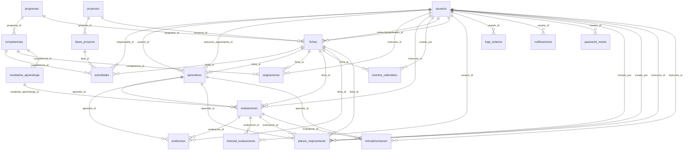

# Diccionario de datos

<!-- Generado por bin/generar-docs.php. No editar a mano: vuelve a ejecutar el script. -->

Base MariaDB/MySQL, motor InnoDB, `utf8mb4`. 22 tablas. El esquema versionado está en `database/esquema.sql` y los cambios en `database/migraciones/`.

## Diagrama entidad-relación

## Tablas

### `actividades`

Actividades de aprendizaje de una ficha dentro de una fase del proyecto; su avance da el avance del proyecto.

| Columna | Tipo | Nulo | Por defecto | Clave / referencia |
|---|---|---|---|---|
| `id` | int(11) | no | — | PK  autoincremental |
| `ficha_id` | int(11) | no | — | → fichas.id |
| `competencia_id` | int(11) | sí | `NULL` | → competencias.id |
| `fase_id` | int(11) | sí | `NULL` | → fases_proyecto.id |
| `nombre` | varchar(255) | no | — |  |
| `descripcion` | text | sí | `NULL` |  |
| `fecha_inicio` | date | sí | `NULL` |  |
| `fecha_fin` | date | sí | `NULL` |  |
| `responsable_id` | int(11) | sí | `NULL` | → usuarios.id |
| `estado` | enum('pendiente','en_progreso','completada','cancelada') | sí | `'pendiente'` |  |
| `cumplimiento_porcentaje` | decimal(5,2) | sí | `0.00` |  |
| `fecha_creacion` | timestamp | no | `current_timestamp()` |  |
| `fecha_actualizacion` | timestamp | no | `current_timestamp()` |  |

### `aprendices`

Matrícula de cada aprendiz en una ficha, con su documento, estado e instructor de seguimiento.

| Columna | Tipo | Nulo | Por defecto | Clave / referencia |
|---|---|---|---|---|
| `id` | int(11) | no | — | PK  autoincremental |
| `usuario_id` | int(11) | no | — | → usuarios.id |
| `ficha_id` | int(11) | sí | `NULL` | → fichas.id |
| `instructor_seguimiento_id` | int(11) | sí | `NULL` | → usuarios.id |
| `numero_documento` | varchar(50) | no | — | Única |
| `tipo_documento` | enum('CC','TI','CE','PEP','PA') | sí | `'CC'` |  |
| `genero` | enum('M','F','O') | sí | `'O'` |  |
| `fecha_nacimiento` | date | sí | `NULL` |  |
| `telefono` | varchar(20) | sí | `NULL` |  |
| `ciudad` | varchar(100) | sí | `NULL` |  |
| `estado` | enum('matriculado','suspendido','desertado','egresado','etapa_practica') | no | `'matriculado'` |  |
| `fecha_matricula` | timestamp | no | `current_timestamp()` |  |
| `fecha_actualizacion` | timestamp | no | `current_timestamp()` |  |

### `asignaciones`

Quién califica cada competencia en una ficha (si no hay asignación, el líder).

| Columna | Tipo | Nulo | Por defecto | Clave / referencia |
|---|---|---|---|---|
| `id` | int(11) | no | — | PK  autoincremental |
| `ficha_id` | int(11) | no | — | → fichas.id |
| `competencia_id` | int(11) | no | — | → competencias.id |
| `instructor_id` | int(11) | no | — | → usuarios.id |
| `fecha_asignacion` | timestamp | no | `current_timestamp()` |  |

### `competencias`

Competencias de cada programa; `es_etapa_practica` marca las que califica el instructor de seguimiento.

| Columna | Tipo | Nulo | Por defecto | Clave / referencia |
|---|---|---|---|---|
| `id` | int(11) | no | — | PK  autoincremental |
| `programa_id` | int(11) | no | — | → programas.id |
| `nombre` | varchar(255) | no | — |  |
| `es_etapa_practica` | tinyint(1) | no | `0` |  |
| `codigo` | varchar(100) | sí | `NULL` |  |
| `descripcion` | text | sí | `NULL` |  |
| `horas` | int(11) | sí | `NULL` |  |
| `estado` | enum('activo','inactivo') | sí | `'activo'` |  |
| `fecha_creacion` | timestamp | no | `current_timestamp()` |  |
| `fecha_actualizacion` | timestamp | no | `current_timestamp()` |  |

### `configuraciones_sistema`

Parámetros institucionales editables (nombre del sistema, centro de formación).

| Columna | Tipo | Nulo | Por defecto | Clave / referencia |
|---|---|---|---|---|
| `clave` | varchar(60) | no | — | PK |
| `valor` | text | no | — |  |
| `fecha_actualizacion` | timestamp | no | `current_timestamp()` |  |

### `evaluaciones`

Un juicio por aprendiz y RAP: A, D o pendiente. `instructor_id` es quien responde por él.

| Columna | Tipo | Nulo | Por defecto | Clave / referencia |
|---|---|---|---|---|
| `id` | int(11) | no | — | PK  autoincremental |
| `resultado_aprendizaje_id` | int(11) | no | — | → resultados_aprendizaje.id |
| `aprendiz_id` | int(11) | no | — | → aprendices.id |
| `instructor_id` | int(11) | no | — | → usuarios.id |
| `ficha_id` | int(11) | no | — | → fichas.id |
| `concepto` | enum('A','D','pendiente') | sí | `'pendiente'` |  |
| `comentario` | text | sí | `NULL` |  |
| `fecha_evaluacion` | date | sí | `NULL` |  |
| `fecha_creacion` | timestamp | no | `current_timestamp()` |  |
| `fecha_actualizacion` | timestamp | no | `current_timestamp()` |  |

### `eventos_calendario`

Eventos creados a mano en el calendario de una ficha.

| Columna | Tipo | Nulo | Por defecto | Clave / referencia |
|---|---|---|---|---|
| `id` | int(11) | no | — | PK  autoincremental |
| `titulo` | varchar(150) | no | — |  |
| `descripcion` | text | sí | `NULL` |  |
| `fecha` | date | no | — |  |
| `ficha_id` | int(11) | no | — | → fichas.id |
| `creado_por` | int(11) | no | — | → usuarios.id |
| `color` | varchar(7) | no | `'#f59e0b'` |  |
| `fecha_creacion` | timestamp | no | `current_timestamp()` |  |

### `evidencias`

Entregas de los aprendices, opcionalmente ligadas a un RAP, con su revisión.

| Columna | Tipo | Nulo | Por defecto | Clave / referencia |
|---|---|---|---|---|
| `id` | int(11) | no | — | PK  autoincremental |
| `evaluacion_id` | int(11) | sí | `NULL` | → evaluaciones.id |
| `aprendiz_id` | int(11) | no | — | → aprendices.id |
| `ficha_id` | int(11) | no | — | → fichas.id |
| `titulo` | varchar(255) | no | — |  |
| `descripcion` | text | sí | `NULL` |  |
| `archivo_url` | varchar(500) | sí | `NULL` |  |
| `tipo_archivo` | varchar(50) | sí | `NULL` |  |
| `tamaño_kb` | int(11) | sí | `NULL` |  |
| `estado` | enum('enviada','revisada','aprobada','rechazada') | sí | `'enviada'` |  |
| `retroalimentacion` | text | sí | `NULL` |  |
| `fecha_envio` | timestamp | no | `current_timestamp()` |  |
| `fecha_revision` | date | sí | `NULL` |  |
| `fecha_actualizacion` | timestamp | no | `current_timestamp()` |  |

### `fases_proyecto`

Fases de cada proyecto formativo (análisis, planeación, ejecución, evaluación…).

| Columna | Tipo | Nulo | Por defecto | Clave / referencia |
|---|---|---|---|---|
| `id` | int(11) | no | — | PK  autoincremental |
| `proyecto_id` | int(11) | no | — | → proyectos.id |
| `numero_fase` | int(11) | no | — |  |
| `nombre` | varchar(150) | no | — |  |
| `descripcion` | text | sí | `NULL` |  |
| `fecha_inicio` | date | sí | `NULL` |  |
| `fecha_fin` | date | sí | `NULL` |  |
| `cumplimiento_porcentaje` | decimal(5,2) | sí | `0.00` |  |
| `estado` | enum('planeada','en_ejecucion','completada') | sí | `'planeada'` |  |
| `fecha_creacion` | timestamp | no | `current_timestamp()` |  |
| `fecha_actualizacion` | timestamp | no | `current_timestamp()` |  |

### `fichas`

Grupos de formación: programa, proyecto formativo, instructor líder, estado y fechas.

| Columna | Tipo | Nulo | Por defecto | Clave / referencia |
|---|---|---|---|---|
| `id` | int(11) | no | — | PK  autoincremental |
| `numero_ficha` | varchar(50) | no | — | Única |
| `programa_id` | int(11) | no | — | → programas.id |
| `proyecto_id` | int(11) | sí | `NULL` | → proyectos.id |
| `instructor_id` | int(11) | no | — | → usuarios.id |
| `coordinador_id` | int(11) | sí | `NULL` | → usuarios.id |
| `estado` | enum('planeacion','induccion','ejecucion','cierre') | sí | `'planeacion'` |  |
| `fecha_inicio` | date | sí | `NULL` |  |
| `fecha_fin` | date | sí | `NULL` |  |
| `fecha_creacion` | timestamp | no | `current_timestamp()` |  |
| `fecha_actualizacion` | timestamp | no | `current_timestamp()` |  |

### `historial_evaluaciones`

Cada cambio de juicio: anterior, nuevo, motivo, quién y cuándo (RNF02).

| Columna | Tipo | Nulo | Por defecto | Clave / referencia |
|---|---|---|---|---|
| `id` | int(11) | no | — | PK  autoincremental |
| `evaluacion_id` | int(11) | no | — | → evaluaciones.id |
| `usuario_id` | int(11) | no | — | → usuarios.id |
| `concepto_anterior` | enum('A','D','pendiente') | no | — |  |
| `concepto_nuevo` | enum('A','D','pendiente') | no | — |  |
| `motivo` | text | sí | `NULL` |  |
| `fecha_cambio` | timestamp | no | `current_timestamp()` |  |

### `intentos_acceso`

Intentos fallidos de inicio de sesión por correo e IP, para el bloqueo temporal.

| Columna | Tipo | Nulo | Por defecto | Clave / referencia |
|---|---|---|---|---|
| `id` | int(11) | no | — | PK  autoincremental |
| `accion` | varchar(40) | no | — |  |
| `clave` | varchar(80) | no | — |  |
| `intentos` | int(11) | no | `0` |  |
| `primer_intento` | timestamp | no | `current_timestamp()` |  |
| `ultimo_intento` | timestamp | no | `current_timestamp()` |  |

### `logs_sistema`

Bitácora de auditoría: quién hizo qué, sobre qué registro y desde qué IP.

| Columna | Tipo | Nulo | Por defecto | Clave / referencia |
|---|---|---|---|---|
| `id` | int(11) | no | — | PK  autoincremental |
| `usuario_id` | int(11) | sí | `NULL` | → usuarios.id |
| `accion` | varchar(100) | no | — |  |
| `modulo` | varchar(100) | sí | `NULL` |  |
| `tabla_afectada` | varchar(100) | sí | `NULL` |  |
| `id_registro` | int(11) | sí | `NULL` |  |
| `descripcion` | text | sí | `NULL` |  |
| `ip_address` | varchar(45) | sí | `NULL` |  |
| `fecha` | timestamp | no | `current_timestamp()` |  |

### `migraciones`

Migraciones de esquema aplicadas (bin/migrar.php).

| Columna | Tipo | Nulo | Por defecto | Clave / referencia |
|---|---|---|---|---|
| `id` | varchar(100) | no | — | PK |
| `descripcion` | varchar(255) | no | `''` |  |
| `aplicada_en` | timestamp | no | `current_timestamp()` |  |
| `duracion_ms` | int(11) | no | `0` |  |

### `notificaciones`

Avisos internos a cada usuario.

| Columna | Tipo | Nulo | Por defecto | Clave / referencia |
|---|---|---|---|---|
| `id` | int(11) | no | — | PK  autoincremental |
| `usuario_id` | int(11) | no | — | → usuarios.id |
| `titulo` | varchar(255) | no | — |  |
| `mensaje` | text | no | — |  |
| `tipo` | varchar(50) | sí | `'info'` |  |
| `url` | varchar(255) | sí | `NULL` |  |
| `leida` | tinyint(1) | sí | `0` |  |
| `fecha_creacion` | timestamp | no | `current_timestamp()` |  |

### `password_resets`

Solicitudes de recuperación de contraseña; el token se guarda con hash y caduca.

| Columna | Tipo | Nulo | Por defecto | Clave / referencia |
|---|---|---|---|---|
| `id` | int(11) | no | — | PK  autoincremental |
| `usuario_id` | int(11) | no | — | → usuarios.id |
| `token_hash` | varchar(255) | no | — |  |
| `expira_en` | datetime | no | — |  |
| `usado` | tinyint(1) | sí | `0` |  |
| `ip_solicitud` | varchar(45) | sí | `NULL` |  |
| `fecha_creacion` | timestamp | no | `current_timestamp()` |  |

### `planes_mejoramiento`

Planes de mejoramiento de RAP en D: actividades, plazo, estado y cierre.

| Columna | Tipo | Nulo | Por defecto | Clave / referencia |
|---|---|---|---|---|
| `id` | int(11) | no | — | PK  autoincremental |
| `evaluacion_id` | int(11) | no | — | → evaluaciones.id |
| `aprendiz_id` | int(11) | no | — | → aprendices.id |
| `ficha_id` | int(11) | no | — | → fichas.id |
| `instructor_id` | int(11) | no | — | → usuarios.id |
| `actividades` | text | no | — |  |
| `fecha_inicio` | date | no | — |  |
| `fecha_limite` | date | no | — |  |
| `estado` | enum('abierto','en_curso','cumplido','no_cumplido') | no | `'abierto'` |  |
| `observaciones_cierre` | text | sí | `NULL` |  |
| `fecha_cierre` | datetime | sí | `NULL` |  |
| `cerrado_por` | int(11) | sí | `NULL` | → usuarios.id |
| `creado_por` | int(11) | no | — | → usuarios.id |
| `fecha_creacion` | timestamp | no | `current_timestamp()` |  |
| `fecha_actualizacion` | timestamp | no | `current_timestamp()` |  |

### `programas`

Programas de formación del SENA (ADSO, Contabilidad…).

| Columna | Tipo | Nulo | Por defecto | Clave / referencia |
|---|---|---|---|---|
| `id` | int(11) | no | — | PK  autoincremental |
| `nombre` | varchar(200) | no | — |  |
| `codigo` | varchar(50) | no | — | Única |
| `descripcion` | text | sí | `NULL` |  |
| `duracion_horas` | int(11) | sí | `NULL` |  |
| `estado` | enum('activo','inactivo','archivado') | sí | `'activo'` |  |
| `fecha_creacion` | timestamp | no | `current_timestamp()` |  |
| `fecha_actualizacion` | timestamp | no | `current_timestamp()` |  |

### `proyectos`

Proyectos formativos, asociados a un programa.

| Columna | Tipo | Nulo | Por defecto | Clave / referencia |
|---|---|---|---|---|
| `id` | int(11) | no | — | PK  autoincremental |
| `nombre` | varchar(255) | no | — |  |
| `codigo` | varchar(50) | no | — | Única |
| `objetivo` | text | sí | `NULL` |  |
| `descripcion` | text | sí | `NULL` |  |
| `estado` | enum('activo','inactivo','finalizado') | sí | `'activo'` |  |
| `fecha_creacion` | timestamp | no | `current_timestamp()` |  |
| `fecha_actualizacion` | timestamp | no | `current_timestamp()` |  |

### `resultados_aprendizaje`

Resultados de aprendizaje (RAP) de cada competencia: la unidad que se evalúa.

| Columna | Tipo | Nulo | Por defecto | Clave / referencia |
|---|---|---|---|---|
| `id` | int(11) | no | — | PK  autoincremental |
| `competencia_id` | int(11) | no | — | → competencias.id |
| `codigo` | varchar(50) | no | — | Única |
| `denominacion` | text | no | — |  |
| `estado` | enum('activo','inactivo') | sí | `'activo'` |  |
| `fecha_creacion` | timestamp | no | `current_timestamp()` |  |
| `fecha_actualizacion` | timestamp | no | `current_timestamp()` |  |

### `retroalimentacion`

Fortalezas, aspectos a mejorar y recomendaciones; las privadas no las ve el aprendiz.

| Columna | Tipo | Nulo | Por defecto | Clave / referencia |
|---|---|---|---|---|
| `id` | int(11) | no | — | PK  autoincremental |
| `evaluacion_id` | int(11) | sí | `NULL` | → evaluaciones.id |
| `aprendiz_id` | int(11) | no | — | → aprendices.id |
| `instructor_id` | int(11) | no | — | → usuarios.id |
| `tipo` | enum('fortaleza','aspecto_mejorar','recomendacion') | sí | `'aspecto_mejorar'` |  |
| `contenido` | text | no | — |  |
| `privada` | tinyint(1) | sí | `0` |  |
| `fecha_creacion` | timestamp | no | `current_timestamp()` |  |
| `fecha_actualizacion` | timestamp | no | `current_timestamp()` |  |

### `usuarios`

Cuentas de acceso de los tres roles. La contraseña se guarda con password_hash; `debe_cambiar_password` obliga a cambiar la temporal.

| Columna | Tipo | Nulo | Por defecto | Clave / referencia |
|---|---|---|---|---|
| `id` | int(11) | no | — | PK  autoincremental |
| `email` | varchar(120) | no | — | Única |
| `password` | varchar(255) | no | — |  |
| `debe_cambiar_password` | tinyint(1) | no | `0` |  |
| `nombre` | varchar(150) | no | — |  |
| `rol` | enum('coordinador','instructor','aprendiz') | no | — |  |
| `avatar_color` | varchar(7) | sí | `'#39A900'` |  |
| `estado` | enum('activo','inactivo','bloqueado') | sí | `'activo'` |  |
| `fecha_creacion` | timestamp | no | `current_timestamp()` |  |
| `fecha_actualizacion` | timestamp | no | `current_timestamp()` |  |

