# Diagramas de flujo

**Sistema de Seguimiento de Proyectos Formativos — SENA**

Procesos del sistema tal como están implementados. Los diagramas están en Mermaid: GitHub y la mayoría de editores los dibujan. Cada flujo indica la pantalla (ruta) y la pieza de código que aplica la regla.

| # | Proceso | Actores |
|---|---|---|
| 1 | [Inicio de sesión y bloqueo por intentos](#1-inicio-de-sesión-y-bloqueo-por-intentos) | Todos |
| 2 | [Recuperación de contraseña](#2-recuperación-de-contraseña) | Todos |
| 3 | [Contraseña temporal y cambio obligatorio](#3-contraseña-temporal-y-cambio-obligatorio) | Todos |
| 4 | [Control de acceso de cada petición](#4-control-de-acceso-de-cada-petición) | Sistema |
| 5 | [Estructura curricular](#5-estructura-curricular) | Coordinación |
| 6 | [Importación en dos pasos](#6-importación-en-dos-pasos) | Coordinación, instructor |
| 7 | [Ficha, matrícula y rejilla de evaluaciones](#7-ficha-matrícula-y-rejilla-de-evaluaciones) | Coordinación |
| 8 | [Asignación de instructores y responsable de cada juicio](#8-asignación-de-instructores-y-responsable-de-cada-juicio) | Coordinación |
| 9 | [Proyecto formativo: fases, actividades y avance](#9-proyecto-formativo-fases-actividades-y-avance) | Coordinación, instructor |
| 10 | [Emitir o cambiar un juicio](#10-emitir-o-cambiar-un-juicio) | Instructor, coordinación |
| 11 | [Importar juicios de Sofia Plus](#11-importar-juicios-de-sofia-plus) | Instructor, coordinación |
| 12 | [Evidencias: entrega, revisión y descarga](#12-evidencias-entrega-revisión-y-descarga) | Aprendiz, instructor |
| 13 | [Plan de mejoramiento](#13-plan-de-mejoramiento) | Instructor, aprendiz |
| 14 | [Seguimiento y semáforo](#14-seguimiento-y-semáforo) | Instructor, coordinación, aprendiz |
| 15 | [Reportes y exportación](#15-reportes-y-exportación) | Instructor, coordinación |
| 16 | [Avisos (notificaciones)](#16-avisos-notificaciones) | Sistema |
| 17 | [Ciclos de vida (estados)](#17-ciclos-de-vida-estados) | — |

---

## 1. Inicio de sesión y bloqueo por intentos

`login.php` · `includes/auth.php` · `Core\Services\LimitadorIntentos`

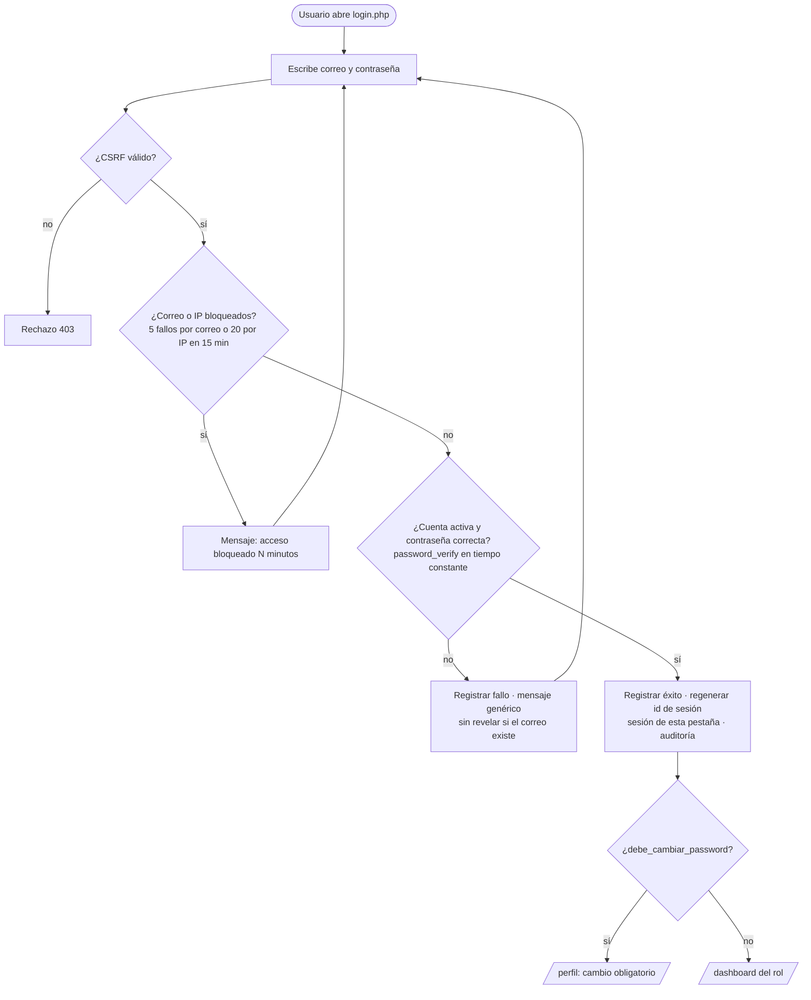
```mermaid
flowchart TD
    A([Usuario abre login.php]) --> B[Escribe correo y contraseña]
    B --> C{¿CSRF válido?}
    C -->|no| X[Rechazo 403]
    C -->|sí| D{¿Correo o IP bloqueados?<br/>5 fallos por correo o 20 por IP en 15 min}
    D -->|sí| E[Mensaje: acceso bloqueado N minutos] --> B
    D -->|no| F{¿Cuenta activa y contraseña correcta?<br/>password_verify en tiempo constante}
    F -->|no| G[Registrar fallo · mensaje genérico<br/>sin revelar si el correo existe] --> B
    F -->|sí| H[Registrar éxito · regenerar id de sesión<br/>sesión de esta pestaña · auditoría]
    H --> I{¿debe_cambiar_password?}
    I -->|sí| P[/perfil: cambio obligatorio/]
    I -->|no| J[/dashboard del rol/]
```

- La sesión es **por pestaña** (`_tab`): dos pestañas pueden tener usuarios distintos.
- Tras 2 horas sin actividad la sesión de la pestaña caduca.
- En cada petición se revalida la cuenta: si la coordinación la desactiva o cambia el rol, se aplica de inmediato.

## 2. Recuperación de contraseña

`recover.php` · `Core\Services\MailService`

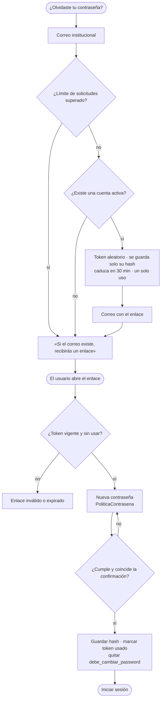
```mermaid
flowchart TD
    A([¿Olvidaste tu contraseña?]) --> B[Correo institucional]
    B --> C{¿Límite de solicitudes superado?}
    C -->|sí| M[Mismo mensaje que siempre]
    C -->|no| D{¿Existe una cuenta activa?}
    D -->|no| M
    D -->|sí| E[Token aleatorio · se guarda solo su hash<br/>caduca en 30 min · un solo uso]
    E --> F[Correo con el enlace]
    F --> M[«Si el correo existe, recibirás un enlace»]
    M --> G([El usuario abre el enlace])
    G --> H{¿Token vigente y sin usar?}
    H -->|no| I[Enlace inválido o expirado]
    H -->|sí| J[Nueva contraseña<br/>PoliticaContrasena]
    J --> K{¿Cumple y coincide la confirmación?}
    K -->|no| J
    K -->|sí| L[Guardar hash · marcar token usado<br/>quitar debe_cambiar_password] --> Z([Iniciar sesión])
```

La respuesta es idéntica exista o no la cuenta, para no revelar qué correos están registrados.

## 3. Contraseña temporal y cambio obligatorio

`/usuarios` (crear, restablecer), `/matriculas` (matricular), importaciones · `/perfil`

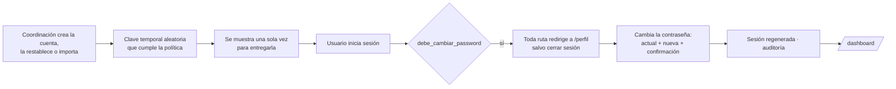
```mermaid
flowchart LR
    A[Coordinación crea la cuenta,<br/>la restablece o importa] --> B[Clave temporal aleatoria<br/>que cumple la política]
    B --> C[Se muestra una sola vez<br/>para entregarla]
    C --> D[Usuario inicia sesión]
    D --> E{debe_cambiar_password}
    E -->|sí| F[Toda ruta redirige a /perfil<br/>salvo cerrar sesión]
    F --> G[Cambia la contraseña:<br/>actual + nueva + confirmación] --> H[Sesión regenerada · auditoría] --> I[/dashboard/]
```

## 4. Control de acceso de cada petición

`index.php` · `Core\Router` · servicios

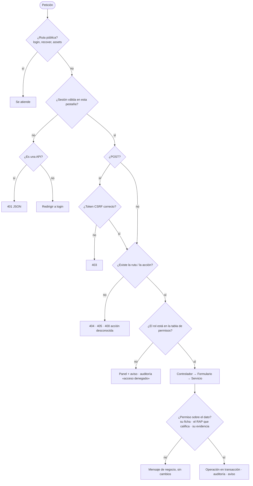
```mermaid
flowchart TD
    A([Petición]) --> B{¿Ruta pública?<br/>login, recover, assets}
    B -->|sí| Z[Se atiende]
    B -->|no| C{¿Sesión válida en esta pestaña?}
    C -->|no| D{¿Es una API?}
    D -->|sí| E[401 JSON]
    D -->|no| F[Redirigir a login]
    C -->|sí| G{¿POST?}
    G -->|sí| H{¿Token CSRF correcto?}
    H -->|no| I[403]
    H -->|sí| J
    G -->|no| J{¿Existe la ruta / la acción?}
    J -->|no| K[404 · 405 · 400 acción desconocida]
    J -->|sí| L{¿El rol está en la tabla de permisos?}
    L -->|no| M[Panel + aviso · auditoría «acceso denegado»]
    L -->|sí| N[Controlador → Formulario → Servicio]
    N --> O{¿Permiso sobre el dato?<br/>su ficha · el RAP que califica · su evidencia}
    O -->|no| P[Mensaje de negocio, sin cambios]
    O -->|sí| Q[Operación en transacción · auditoría · aviso]
```

## 5. Estructura curricular

`/programas` · `/competencias` · `/resultados-aprendizaje` · `/estructura`

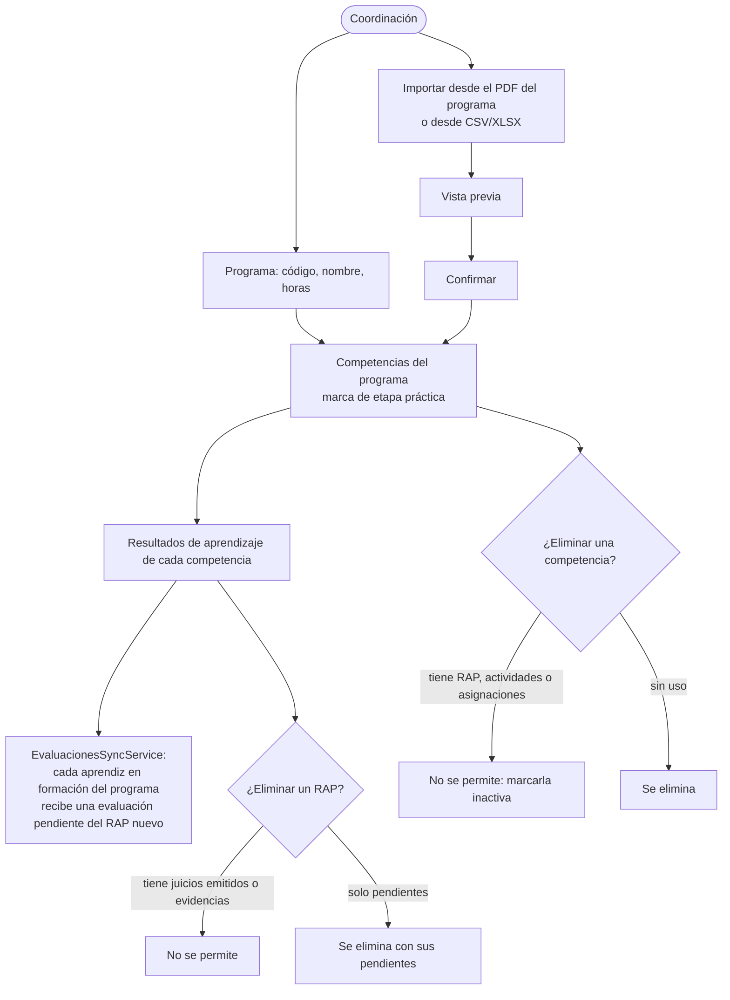
```mermaid
flowchart TD
    A([Coordinación]) --> B[Programa: código, nombre, horas]
    B --> C[Competencias del programa<br/>marca de etapa práctica]
    C --> D[Resultados de aprendizaje de cada competencia]
    A --> E[Importar desde el PDF del programa<br/>o desde CSV/XLSX] --> F[Vista previa] --> G[Confirmar]
    G --> C
    D --> H[EvaluacionesSyncService:<br/>cada aprendiz en formación del programa<br/>recibe una evaluación pendiente del RAP nuevo]
    C --> I{¿Eliminar una competencia?}
    I -->|tiene RAP, actividades o asignaciones| J[No se permite: marcarla inactiva]
    I -->|sin uso| K[Se elimina]
    D --> R{¿Eliminar un RAP?}
    R -->|tiene juicios emitidos o evidencias| J2[No se permite]
    R -->|solo pendientes| K2[Se elimina con sus pendientes]
```

## 6. Importación en dos pasos

`/usuarios/importar` · `/competencias/importar` · `/resultados-aprendizaje/importar` · `/matriculas/importar` · `/evaluaciones/importar` · `Core\Importacion`

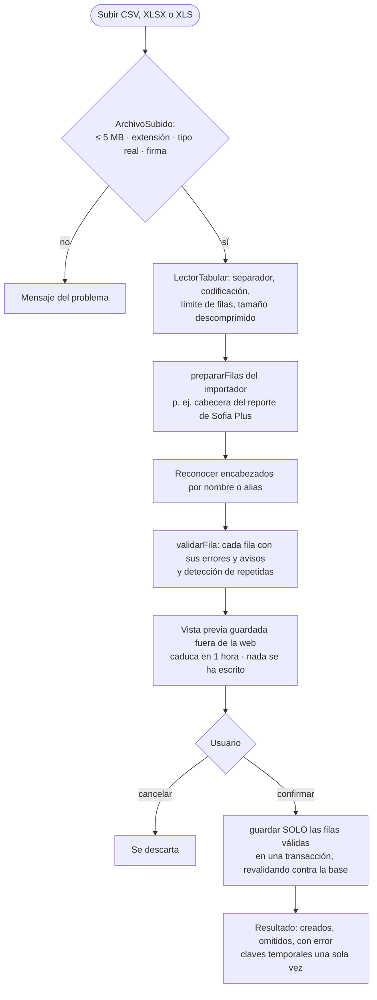
```mermaid
flowchart TD
    A([Subir CSV, XLSX o XLS]) --> B{ArchivoSubido:<br/>≤ 5 MB · extensión · tipo real · firma}
    B -->|no| X[Mensaje del problema]
    B -->|sí| C[LectorTabular: separador, codificación,<br/>límite de filas, tamaño descomprimido]
    C --> D[prepararFilas del importador<br/>p. ej. cabecera del reporte de Sofia Plus]
    D --> E[Reconocer encabezados por nombre o alias]
    E --> F[validarFila: cada fila con sus errores y avisos<br/>y detección de repetidas]
    F --> G[Vista previa guardada fuera de la web<br/>caduca en 1 hora · nada se ha escrito]
    G --> H{Usuario}
    H -->|cancelar| I[Se descarta]
    H -->|confirmar| J[guardar SOLO las filas válidas<br/>en una transacción, revalidando contra la base]
    J --> K[Resultado: creados, omitidos, con error<br/>claves temporales una sola vez]
```

Formatos y columnas: [FORMATOS_IMPORTACION.md](FORMATOS_IMPORTACION.md).

## 7. Ficha, matrícula y rejilla de evaluaciones

`/fichas` · `/matriculas` · `FichasService` · `MatriculasService` · `EvaluacionesSyncService`

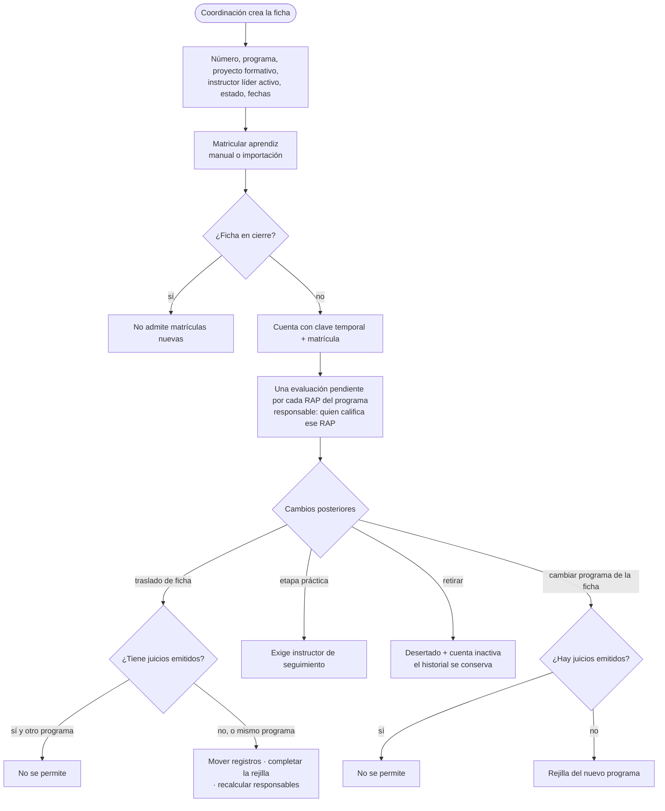
```mermaid
flowchart TD
    A([Coordinación crea la ficha]) --> B[Número, programa, proyecto formativo,<br/>instructor líder activo, estado, fechas]
    B --> C[Matricular aprendiz<br/>manual o importación]
    C --> D{¿Ficha en cierre?}
    D -->|sí| X[No admite matrículas nuevas]
    D -->|no| E[Cuenta con clave temporal + matrícula]
    E --> F[Una evaluación pendiente por cada RAP del programa<br/>responsable: quien califica ese RAP]
    F --> G{Cambios posteriores}
    G -->|traslado de ficha| H{¿Tiene juicios emitidos?}
    H -->|sí y otro programa| Y[No se permite]
    H -->|no, o mismo programa| I[Mover registros · completar la rejilla<br/>· recalcular responsables]
    G -->|etapa práctica| J[Exige instructor de seguimiento]
    G -->|retirar| K[Desertado + cuenta inactiva<br/>el historial se conserva]
    G -->|cambiar programa de la ficha| L{¿Hay juicios emitidos?}
    L -->|sí| Z[No se permite]
    L -->|no| M[Rejilla del nuevo programa]
```

## 8. Asignación de instructores y responsable de cada juicio

`/asignaciones` · `AsignacionesService` · `EvaluacionesSyncService::actualizarResponsables`

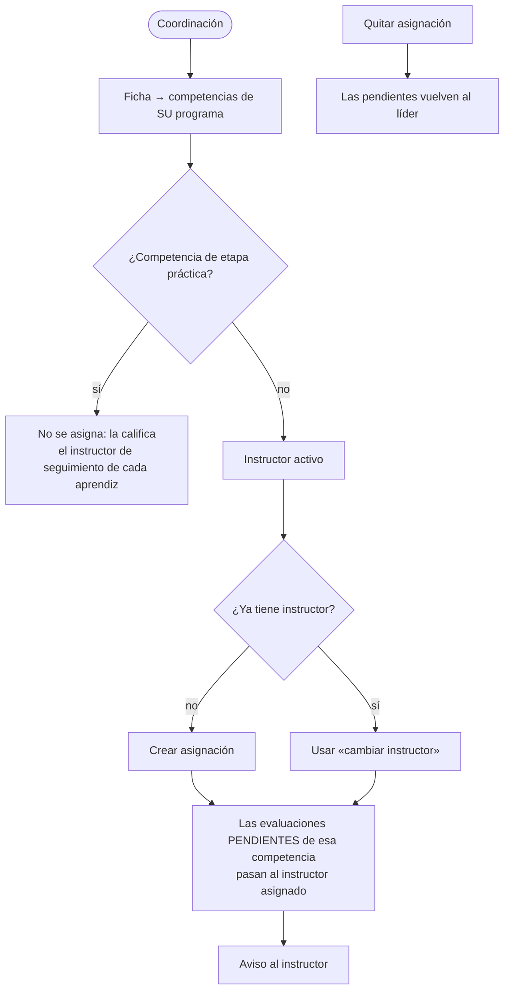
```mermaid
flowchart TD
    A([Coordinación]) --> B[Ficha → competencias de SU programa]
    B --> C{¿Competencia de etapa práctica?}
    C -->|sí| X[No se asigna: la califica<br/>el instructor de seguimiento de cada aprendiz]
    C -->|no| D[Instructor activo]
    D --> E{¿Ya tiene instructor?}
    E -->|sí| F[Usar «cambiar instructor»]
    E -->|no| G[Crear asignación]
    G --> H[Las evaluaciones PENDIENTES de esa competencia<br/>pasan al instructor asignado]
    F --> H
    I[Quitar asignación] --> J[Las pendientes vuelven al líder]
    H --> K[Aviso al instructor]
```

Prelación para calificar un RAP: instructor asignado a la competencia → (etapa práctica) instructor de seguimiento del aprendiz → instructor líder de la ficha. Los juicios ya emitidos conservan a su autor.

## 9. Proyecto formativo: fases, actividades y avance

`/proyectos` · `/fases` · `/actividades`

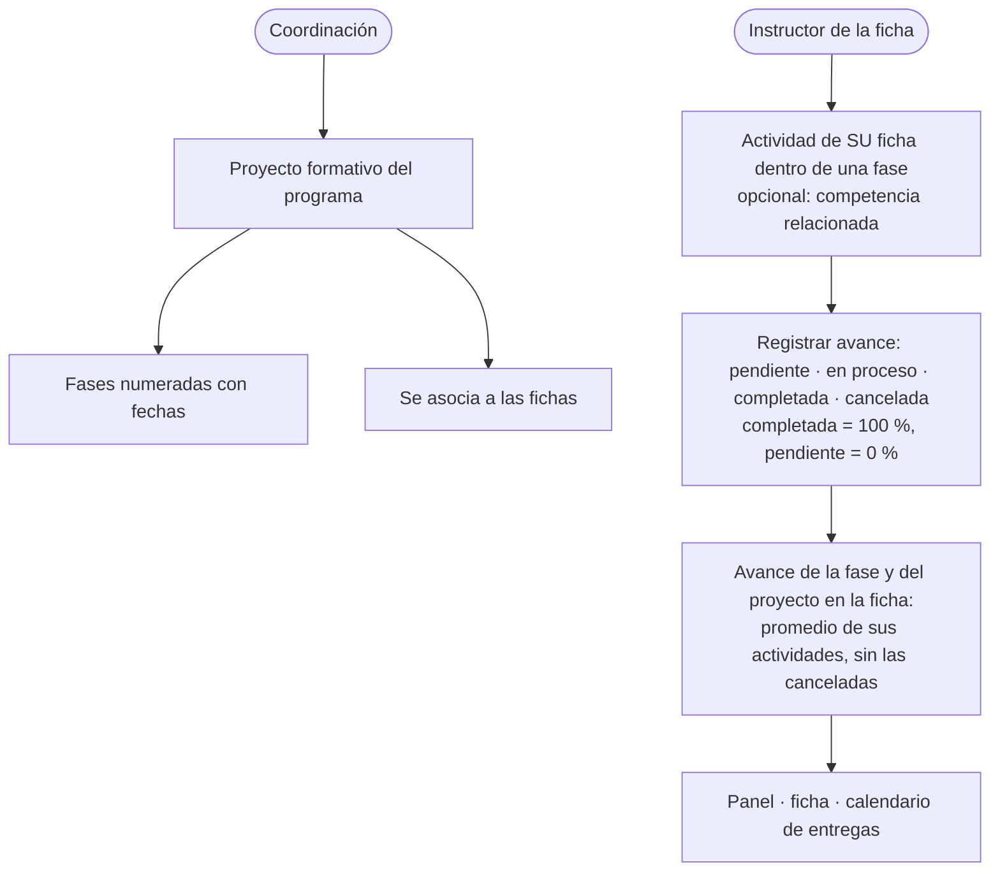
```mermaid
flowchart TD
    A([Coordinación]) --> B[Proyecto formativo del programa]
    B --> C[Fases numeradas con fechas]
    B --> D[Se asocia a las fichas]
    E([Instructor de la ficha]) --> F[Actividad de SU ficha dentro de una fase<br/>opcional: competencia relacionada]
    F --> G[Registrar avance: pendiente · en proceso · completada · cancelada<br/>completada = 100 %, pendiente = 0 %]
    G --> H[Avance de la fase y del proyecto en la ficha:<br/>promedio de sus actividades, sin las canceladas]
    H --> I[Panel · ficha · calendario de entregas]
```

## 10. Emitir o cambiar un juicio

`/evaluaciones` o expediente en `/seguimiento` · `JuiciosService` · `EvaluacionService`

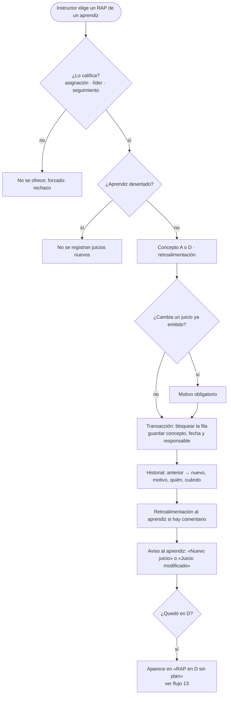
```mermaid
flowchart TD
    A([Instructor elige un RAP de un aprendiz]) --> B{¿Lo califica?<br/>asignación · líder · seguimiento}
    B -->|no| X[No se ofrece; forzado: rechazo]
    B -->|sí| C{¿Aprendiz desertado?}
    C -->|sí| Y[No se registran juicios nuevos]
    C -->|no| D[Concepto A o D · retroalimentación]
    D --> E{¿Cambia un juicio ya emitido?}
    E -->|sí| F[Motivo obligatorio]
    E -->|no| G
    F --> G[Transacción: bloquear la fila<br/>guardar concepto, fecha y responsable]
    G --> H[Historial: anterior → nuevo, motivo, quién, cuándo]
    H --> I[Retroalimentación al aprendiz si hay comentario]
    I --> J[Aviso al aprendiz: «Nuevo juicio» o «Juicio modificado»]
    J --> K{¿Quedó en D?}
    K -->|sí| L[Aparece en «RAP en D sin plan»<br/>ver flujo 13]
```

Volver a «pendiente» a mano no está permitido: sería borrar un juicio.

## 11. Importar juicios de Sofia Plus

`/evaluaciones/importar` · `ImportadorJuicios`

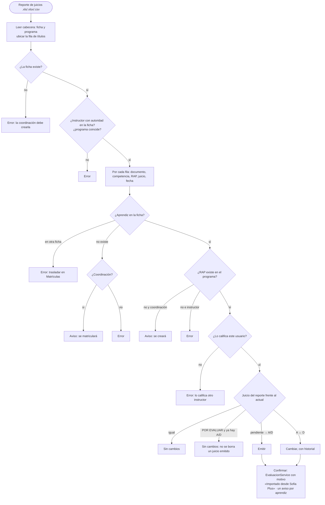
```mermaid
flowchart TD
    A([Reporte de juicios .xls/.xlsx/.csv]) --> B[Leer cabecera: ficha y programa<br/>ubicar la fila de títulos]
    B --> C{¿La ficha existe?}
    C -->|no| X[Error: la coordinación debe crearla]
    C -->|sí| D{¿Instructor con autoridad en la ficha?<br/>¿programa coincide?}
    D -->|no| Y[Error]
    D -->|sí| E[Por cada fila: documento, competencia, RAP, juicio, fecha]
    E --> F{¿Aprendiz en la ficha?}
    F -->|en otra ficha| G[Error: trasladar en Matrículas]
    F -->|no existe| H{¿Coordinación?}
    H -->|sí| I[Aviso: se matriculará]
    H -->|no| J[Error]
    F -->|sí| K{¿RAP existe en el programa?}
    K -->|no y coordinación| L[Aviso: se creará]
    K -->|no e instructor| M[Error]
    K -->|sí| N{¿Lo califica este usuario?}
    N -->|no| O[Error: lo califica otro instructor]
    N -->|sí| P{Juicio del reporte frente al actual}
    P -->|igual| Q[Sin cambios]
    P -->|POR EVALUAR y ya hay A/D| R[Sin cambios: no se borra un juicio emitido]
    P -->|pendiente → A/D| S[Emitir]
    P -->|A ↔ D| T[Cambiar, con historial]
    S & T --> U[Confirmar: EvaluacionService con motivo<br/>«Importado desde Sofia Plus» · un aviso por aprendiz]
```

## 12. Evidencias: entrega, revisión y descarga

`/evidencias` · `EvidenciasService` · `/evidencias/archivo`

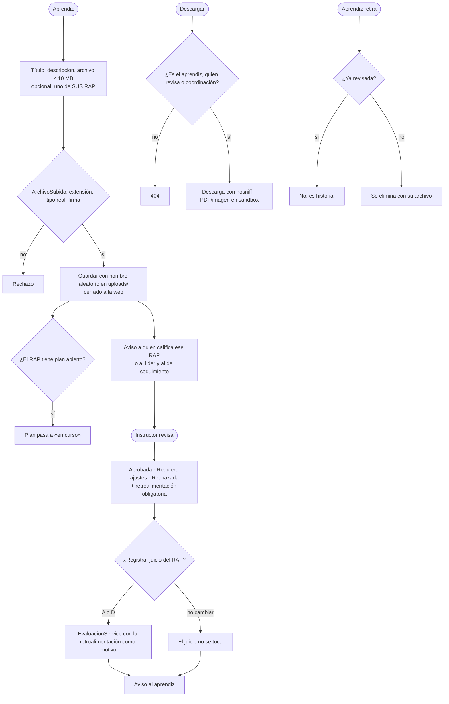
```mermaid
flowchart TD
    A([Aprendiz]) --> B[Título, descripción, archivo ≤ 10 MB<br/>opcional: uno de SUS RAP]
    B --> C{ArchivoSubido: extensión, tipo real, firma}
    C -->|no| X[Rechazo]
    C -->|sí| D[Guardar con nombre aleatorio en uploads/<br/>cerrado a la web]
    D --> E[Aviso a quien califica ese RAP<br/>o al líder y al de seguimiento]
    D --> F{¿El RAP tiene plan abierto?}
    F -->|sí| G[Plan pasa a «en curso»]
    E --> H([Instructor revisa])
    H --> I[Aprobada · Requiere ajustes · Rechazada<br/>+ retroalimentación obligatoria]
    I --> J{¿Registrar juicio del RAP?}
    J -->|A o D| K[EvaluacionService con la retroalimentación como motivo]
    J -->|no cambiar| L[El juicio no se toca]
    K & L --> M[Aviso al aprendiz]
    N([Descargar]) --> O{¿Es el aprendiz, quien revisa o coordinación?}
    O -->|no| P[404]
    O -->|sí| Q[Descarga con nosniff · PDF/imagen en sandbox]
    R([Aprendiz retira]) --> S{¿Ya revisada?}
    S -->|sí| T[No: es historial]
    S -->|no| U[Se elimina con su archivo]
```

## 13. Plan de mejoramiento

`/mejoramiento` · `PlanesService`

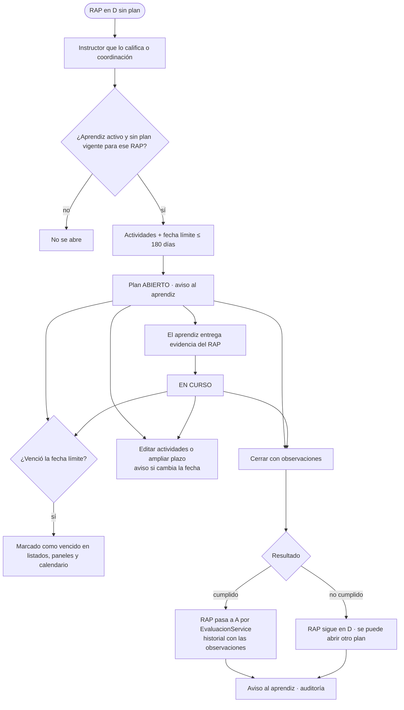
```mermaid
flowchart TD
    A([RAP en D sin plan]) --> B[Instructor que lo califica o coordinación]
    B --> C{¿Aprendiz activo y sin plan vigente para ese RAP?}
    C -->|no| X[No se abre]
    C -->|sí| D[Actividades + fecha límite ≤ 180 días]
    D --> E[Plan ABIERTO · aviso al aprendiz]
    E --> F[El aprendiz entrega evidencia del RAP] --> G[EN CURSO]
    E & G --> H{¿Venció la fecha límite?}
    H -->|sí| I[Marcado como vencido en listados, paneles y calendario]
    E & G --> J[Editar actividades o ampliar plazo<br/>aviso si cambia la fecha]
    E & G --> K[Cerrar con observaciones]
    K --> L{Resultado}
    L -->|cumplido| M[RAP pasa a A por EvaluacionService<br/>historial con las observaciones]
    L -->|no cumplido| N[RAP sigue en D · se puede abrir otro plan]
    M & N --> O[Aviso al aprendiz · auditoría]
```

## 14. Seguimiento y semáforo

`/seguimiento` · `Core\Support\Semaforo`

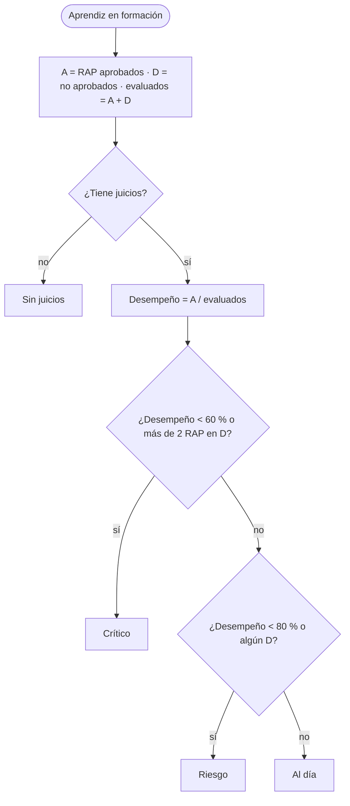
```mermaid
flowchart TD
    A([Aprendiz en formación]) --> B[A = RAP aprobados · D = no aprobados · evaluados = A + D]
    B --> C{¿Tiene juicios?}
    C -->|no| S0[Sin juicios]
    C -->|sí| D[Desempeño = A / evaluados]
    D --> E{¿Desempeño &lt; 60 % o más de 2 RAP en D?}
    E -->|sí| S1[Crítico]
    E -->|no| F{¿Desempeño &lt; 80 % o algún D?}
    F -->|sí| S2[Riesgo]
    F -->|no| S3[Al día]
```

La misma regla clasifica fichas y programas (por su desempeño) en fichas, paneles y reportes. El **avance** (A sobre el total de RAP del programa) se muestra aparte: mide cuánto falta, no el desempeño.

## 15. Reportes y exportación

`/reportes` · `ReportesService` · `Exportador` · `ReportePdfService`

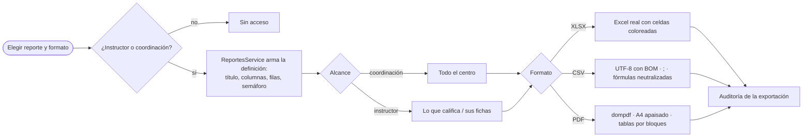
```mermaid
flowchart LR
    A([Elegir reporte y formato]) --> B{¿Instructor o coordinación?}
    B -->|no| X[Sin acceso]
    B -->|sí| C[ReportesService arma la definición:<br/>título, columnas, filas, semáforo]
    C --> D{Alcance}
    D -->|coordinación| E[Todo el centro]
    D -->|instructor| F[Lo que califica / sus fichas]
    E & F --> G{Formato}
    G -->|XLSX| H[Excel real con celdas coloreadas]
    G -->|CSV| I[UTF-8 con BOM · ; · fórmulas neutralizadas]
    G -->|PDF| J[dompdf · A4 apaisado · tablas por bloques]
    H & I & J --> K[Auditoría de la exportación]
```

Listados con exportación propia (con sus filtros): usuarios, fichas, matrículas, juicios, planes de mejoramiento y bitácora.

## 16. Avisos (notificaciones)

`Core\Services\Notificador` · campana de la barra superior (`/api/notificaciones`)

| Evento | Destinatario |
|---|---|
| Juicio nuevo o modificado (A/D) | Aprendiz |
| Juicios importados de Sofia Plus | Aprendiz (uno por importación) |
| Evidencia enviada | Instructor responsable |
| Evidencia revisada | Aprendiz |
| Plan abierto, plazo cambiado, plan cerrado | Aprendiz |
| Retroalimentación pública | Aprendiz |
| Asignación o cambio de competencia | Instructor |
| Nuevo instructor líder de una ficha | Instructor |
| Evento en el calendario de la ficha | Aprendices de la ficha |

Los enlaces de un aviso solo pueden apuntar a rutas internas de la aplicación.

## 17. Ciclos de vida (estados)

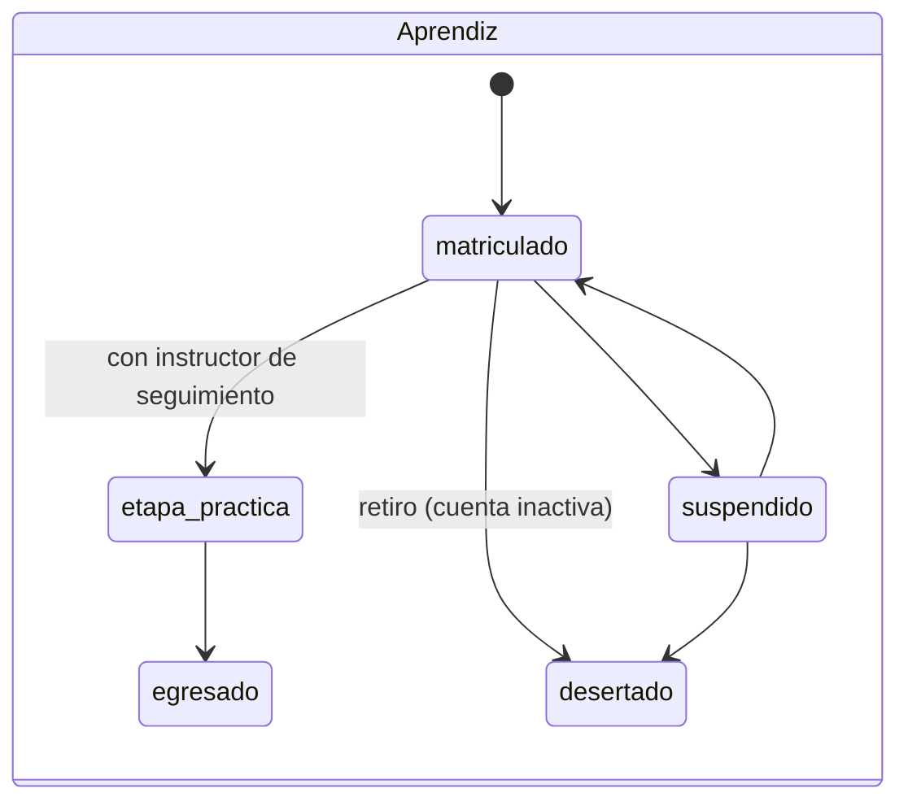
```mermaid
stateDiagram-v2
    direction LR
    state "Aprendiz" as AP {
        [*] --> matriculado
        matriculado --> suspendido
        suspendido --> matriculado
        matriculado --> etapa_practica: con instructor de seguimiento
        etapa_practica --> egresado
        matriculado --> desertado: retiro (cuenta inactiva)
        suspendido --> desertado
    }
```

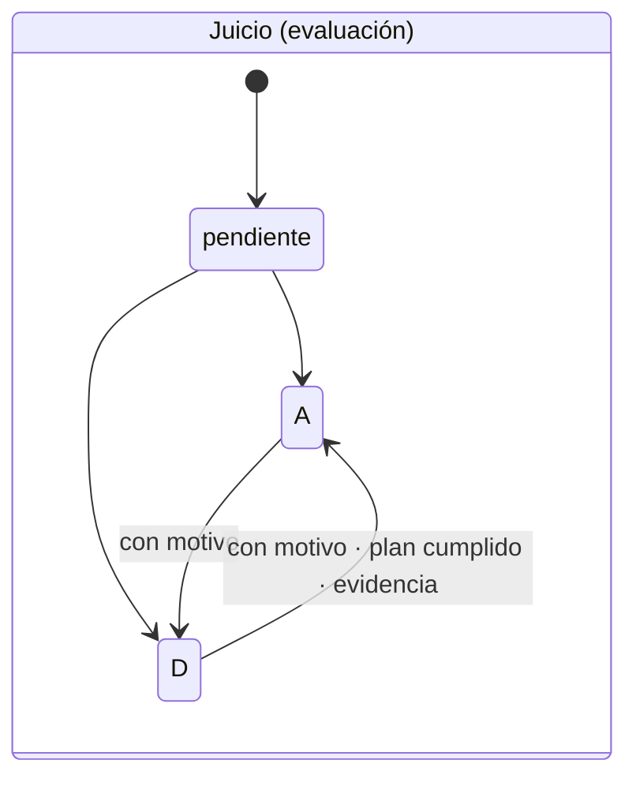
```mermaid
stateDiagram-v2
    direction LR
    state "Juicio (evaluación)" as J {
        [*] --> pendiente
        pendiente --> A
        pendiente --> D
        A --> D: con motivo
        D --> A: con motivo · plan cumplido · evidencia
    }
```

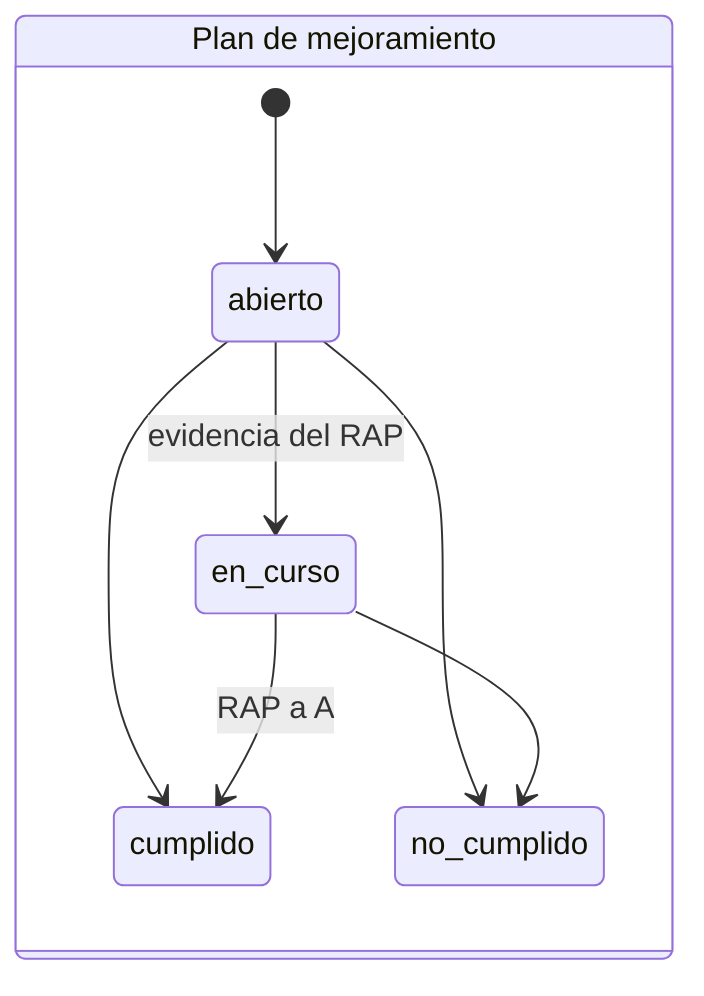
```mermaid
stateDiagram-v2
    direction LR
    state "Plan de mejoramiento" as P {
        [*] --> abierto
        abierto --> en_curso: evidencia del RAP
        abierto --> cumplido
        en_curso --> cumplido: RAP a A
        abierto --> no_cumplido
        en_curso --> no_cumplido
    }
```

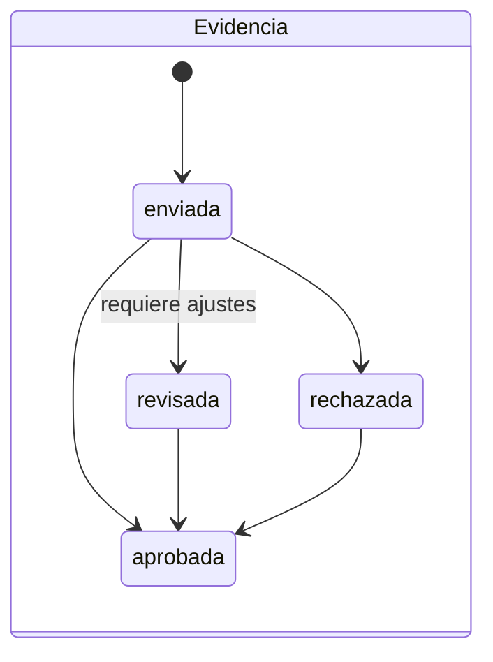
```mermaid
stateDiagram-v2
    direction LR
    state "Evidencia" as E {
        [*] --> enviada
        enviada --> aprobada
        enviada --> revisada: requiere ajustes
        enviada --> rechazada
        revisada --> aprobada
        rechazada --> aprobada
    }
```

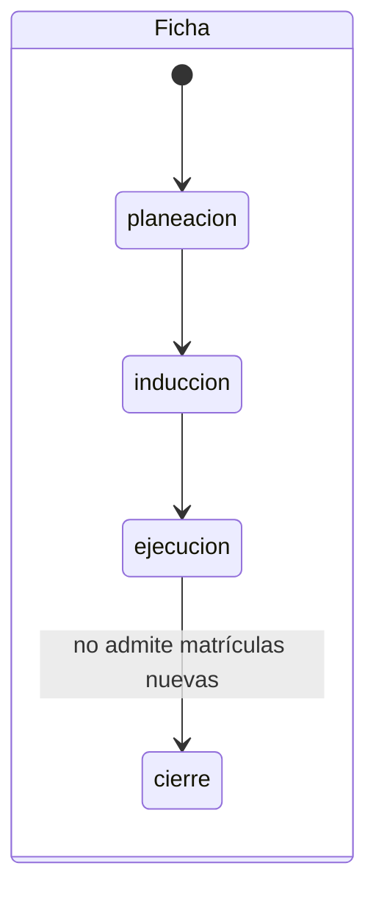
```mermaid
stateDiagram-v2
    direction LR
    state "Ficha" as F {
        [*] --> planeacion
        planeacion --> induccion
        induccion --> ejecucion
        ejecucion --> cierre: no admite matrículas nuevas
    }
```
