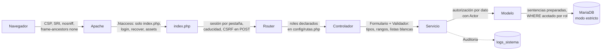

# Seguridad

**Sistema de Seguimiento de Proyectos Formativos — SENA** · versión 3.2 · septiembre de 2026

Informe de la revisión de seguridad: qué se encontró, cómo se corrigió, qué prueba lo protege y qué queda pendiente. La referencia es el **OWASP Top 10 (2021)**.

---

## 1. Alcance y método

| | |
|---|---|
| Alcance | Todo el código (111 destinos del enrutador, 3 páginas públicas, CLI), la configuración de Apache y Docker, la base de datos y el repositorio |
| Revisión de código | Cada consulta SQL, cada salida a HTML, cada formulario, cada subida y descarga, cada regla de acceso por rol y por dato |
| Pruebas automáticas | Suite de seguridad de PHPUnit (8 clases) más pruebas de integración de permisos; se ejecutan en cada envío al repositorio |
| Pruebas en navegador | Recorrido de las 51 pantallas de los tres roles con Playwright: sin errores de JavaScript, sin bloqueos de CSP, sin desbordes a 390 px |
| Pruebas contra Apache | Peticiones directas a archivos internos (`.env`, `.git/`, volcados, `uploads/`, migraciones) antes y después de cada cambio |

## 2. Resumen

| Severidad | Hallazgos | Corregidos |
|---|---:|---:|
| Crítica | 3 | 3 |
| Alta | 12 | 12 |
| Media | 15 | 15 |
| Baja | 6 | 6 |
| **Total** | **36** | **36** |

Quedan **riesgos residuales** que no se resuelven con código (rotar credenciales expuestas, HTTPS, copias de seguridad): ver §6.

---

## 3. Hallazgos y correcciones

Severidad: **C** crítica · **A** alta · **M** media · **B** baja.

### A01 — Control de acceso roto

| # | Sev. | Hallazgo | Corrección | Prueba |
|---|---|---|---|---|
| 1 | C | `.env` (credenciales de la base y contraseña de aplicación SMTP), `.git/` completo y el volcado `sena_seguimiento.sql` (con hashes de contraseñas) se descargaban por web; las migraciones se **ejecutaban** al pedirlas por URL. | `.htaccess` en la raíz que niega archivos ocultos y de proyecto y cierra las carpetas internas; segunda capa en cada carpeta; migraciones y scripts solo por consola. | `SuperficieWebTest` |
| 2 | C | En la imagen Docker, Apache traía `AllowOverride None` e **ignoraba todos los `.htaccess`**. | `Dockerfile` habilita `AllowOverride All`, `ServerTokens Prod`, `expose_php Off`; `.dockerignore` deja fuera `.git`, `.env`, volcados y pruebas. | Revisión de la imagen |
| 3 | C | `install.php` empezaba con `DROP DATABASE` y se podía ejecutar desde el navegador sin autenticación. | Sustituido por `bin/instalar.php`: solo consola y con `--confirmar-borrado-total`. | `EsquemaTest`, `FugaDeInformacionTest` |
| 4 | A | `uploads/` se servía por web: cualquier evidencia o copia de importación (listas de aprendices) se descargaba conociendo su nombre. | `uploads/` cerrado (`Require all denied`, dos capas). Las evidencias se descargan por `/evidencias/archivo`, que comprueba el permiso. | `SubidaDeArchivosTest`, `EvidenciasTest` |
| 5 | A | Nueve controladores solo comprobaban que hubiera sesión, no el rol. | Cada ruta declara sus roles en `config/rutas.php`; el enrutador los exige antes de crear el controlador. | `RutasYPermisosTest` |
| 6 | A | IDOR: marcar como leída cualquier notificación (`WHERE id = ?` sin el usuario). | Todas las escrituras y lecturas se acotan por el actor en la consulta. | `AutorizacionTest` |
| 7 | A | La regla de quién califica dependía de un `LIKE '%ETAPA PRÁCTICA%'` sobre texto libre y tenía cinco copias distintas. | Columna `es_etapa_practica` y una sola condición en `InstructorAccessService`. | `AutorizacionTest` |
| 8 | A | El importador de Sofia Plus creaba fichas con un líder arbitrario y movía aprendices de ficha; un instructor podía cargar juicios de RAP que no califica. | La estructura que falta solo la crea coordinación; el instructor solo carga lo que califica. | `ImportadorJuiciosTest` |
| 9 | M | Las 36 vistas se podían abrir por URL directa. | Guarda en cada vista y `modules/*/views/` negado desde la raíz. | `FugaDeInformacionTest`, `SuperficieWebTest` |
| 10 | M | Un filtro con un valor desconocido (`?rol=x`) se ignoraba y mostraba **todo**. | Un valor fuera de la lista blanca no encaja con nada. | `BusquedaYFiltrosTest` |
| 11 | M | El cambio obligatorio de contraseña se saltaba añadiendo `?x=/perfil` a la URL. | Se compara la ruta, no la URL completa. | Revisión de código |
| 12 | M | Un coordinador podía desactivarse o quitarse el rol y dejar la institución sin administración. | Regla de negocio: siempre queda al menos un coordinador activo. | `GestionAcademicaTest::testSiempreQuedaUnCoordinador` |

### A02 — Fallos criptográficos

| # | Sev. | Hallazgo | Corrección | Prueba |
|---|---|---|---|---|
| 13 | A | `logs/password_resets.log`, con enlaces de recuperación reales, estaba versionado en git. | Se dejó de versionar; el enlace solo se escribe en `DEV_MODE`. El historial de git aún lo contiene: ver §6. | `FugaDeInformacionTest` |
| 14 | M | La contraseña inicial la tecleaba el coordinador (bastaban 6 caracteres) y la conocía para siempre. | El sistema genera una clave temporal y obliga a cambiarla; política única (8+ caracteres, letras y números, máximo 72 bytes, sin el usuario del correo). | `PoliticaContrasenaTest`, `AutenticacionTest` |
| 15 | B | Lo que pasaba de 72 bytes en una contraseña se truncaba en silencio (límite de bcrypt). | `PoliticaContrasena` lo rechaza. | `PoliticaContrasenaTest` |

### A03 — Inyección

| # | Sev. | Hallazgo | Corrección | Prueba |
|---|---|---|---|---|
| 16 | A | **XSS almacenado en el calendario**: la descripción de un evento se pintaba con `innerHTML` y se ejecutaba en el navegador de quien lo abría. | Todo texto con `textContent`. | `SeguridadTest::testJavascriptSinSumiderosHtml`, recorrido e2e |
| 17 | A | **XSS almacenado en la campana de avisos**: título, mensaje y URL en `innerHTML`; un `href="javascript:"` se ejecutaba. | Nodos con `textContent`; la URL se valida como ruta interna en servidor y cliente. | `SeguridadTest::testJavascriptSinSumiderosHtml` |
| 18 | A | La CSP permitía `'unsafe-inline'` en `script-src`: cualquier XSS que llegara al HTML se ejecutaba. | Todo el JavaScript en archivos; `script-src 'self'` más el CDN con SRI. | `SeguridadTest::testSinCodigoEnLinea` |
| 19 | M | `avatar_color` iba sin validar a un atributo `style` (inyección de CSS). | Solo se acepta un color `#RRGGBB`. | `ValidadorTest::testColorHexRechazaCss` |
| 20 | M | **Inyección de fórmulas** en CSV: un texto que empieza por `=` se ejecutaba al abrir el archivo en Excel. | El exportador neutraliza `= + - @`, tabulador y retorno al inicio de la celda. | `SemaforoReporteTest` |
| 21 | M | Los comodines `%` y `_` no se escapaban en los 19 buscadores: buscar «%» devolvía la tabla entera. | `Validador::escaparLike()` en todos. | `BusquedaYFiltrosTest` |
| 22 | M | `sql_mode` sin `STRICT_TRANS_TABLES`: un ENUM inventado se guardaba vacío y una fecha ilegible como `0000-00-00`. | Modo estricto en la conexión y validación con lista blanca antes (`Enums`, `Validador`). | `InyeccionTest`, `EsquemaTest` |
| — | — | Inyección SQL | **No se encontró ninguna.** Todas las consultas usan sentencias preparadas; los identificadores dinámicos (orden, columnas) salen de listas blancas. Se prueban 13 cargas contra cada buscador, incluida inyección temporal con `SLEEP`. | `InyeccionTest` |

### A04 — Diseño inseguro

| # | Sev. | Hallazgo | Corrección | Prueba |
|---|---|---|---|---|
| 23 | A | El bloqueo por intentos vivía en `$_SESSION` y se evadía descartando la cookie; la recuperación de contraseña no tenía límite (enumeración y envío masivo de correos). | `LimitadorIntentos` en base de datos: 5 fallos por correo o 20 por IP en 15 minutos bloquean 15 minutos; también para la recuperación. | `AutenticacionTest` |
| 24 | A | El importador de Sofia Plus leía «NO APROBADO» como **A** (contiene «APROBADO»), y un «POR EVALUAR» devolvía a pendiente un juicio emitido. | Orden de comprobación corregido; «POR EVALUAR» no toca un juicio emitido. | `ImportadorJuiciosTest` |
| 25 | M | Revisar una evidencia como «rechazada» devolvía a pendiente un RAP en A, sin motivo ni historial. | La revisión y el juicio son decisiones separadas; el juicio pasa por `EvaluacionService` con historial. | `EvidenciasTest` |
| 26 | M | Cuatro caminos escribían el juicio y dos no dejaban historial (RNF02). | `EvaluacionService` como única puerta de escritura, con transacción y `SELECT … FOR UPDATE`. | `EvaluacionServiceTest` |

### A05 — Configuración de seguridad incorrecta

| # | Sev. | Hallazgo | Corrección | Prueba |
|---|---|---|---|---|
| 27 | A | `requireCsrf()` imprimía el ID de sesión y los tokens esperados al fallar («Diagnostic Info»). | Eliminado; la respuesta no incluye secretos. | `FugaDeInformacionTest` |
| 28 | M | 49 bloques `catch` mostraban `$e->getMessage()` (nombres de tablas y columnas) y no había manejador global. | `ErrorDeNegocio` distingue mensajes para el usuario de errores técnicos; `ManejadorErrores` registra y responde con una referencia. | `ErrorDeNegocioTest`, `ManejadorErroresTest` |
| 29 | M | Sin cabeceras de seguridad. | CSP, `X-Frame-Options: DENY`, `nosniff`, `Referrer-Policy`, `Permissions-Policy`, HSTS bajo HTTPS; sin `X-Powered-By`; páginas autenticadas sin caché. | `SeguridadTest` |
| 30 | B | `vendor/`, `cache/` y `scratch/` listaban su contenido. | `Options -Indexes` y `.htaccess` de denegación (`bin/proteger-carpetas.php` los regenera tras `composer install`). | `SuperficieWebTest` |
| 31 | B | `X-Content-Type-Options` salía duplicada (Apache y PHP). | Una sola vez. | Revisión contra Apache |

### A06 — Componentes vulnerables

| # | Sev. | Hallazgo | Corrección | Prueba |
|---|---|---|---|---|
| 32 | M | La vista previa de importación cargaba **SheetJS 0.18.5** (vulnerabilidades conocidas) desde un CDN. | Eliminado: la lectura de CSV/XLSX/XLS se hace en el servidor (`LectorTabular`). También se retiró `SimpleXLS` y su script de PowerShell. | — |
| 33 | B | Recursos de CDN sin control de integridad. | Lista blanca `RecursosCdn` y `integrity` en todo recurso de CDN (el inicio de sesión y la recuperación cargaban los iconos sin él). | `SeguridadTest::testRecursosExternosConIntegridad` |

### A07 — Fallos de identificación y autenticación

| # | Sev. | Hallazgo | Corrección | Prueba |
|---|---|---|---|---|
| 34 | M | La sesión no caducaba nunca y el cierre de sesión era por GET sin token. | Inactividad máxima 2 h, duración máxima 12 h, máximo 12 pestañas por sesión; cierre por POST con token; identificador regenerado al entrar y al cambiar la contraseña. | `CsrfYSesionTest` |
| 35 | B | El login delataba qué correos existen por el tiempo de respuesta (y la primera mitigación lo invertía con un hash de relleno mal formado). | Verificación siempre contra un bcrypt real del mismo coste: ratio de tiempos 1,01. | `AutenticacionTest` |

### A08 / A09 / A10

| # | Sev. | Hallazgo | Corrección | Prueba |
|---|---|---|---|---|
| 36 | B | **A09** — No se registraban eventos de seguridad (accesos, fallos, permisos denegados, cambios de contraseña). | `Core\Services\Auditoria` centraliza la bitácora; consultable y exportable en `/logs`. | `AuditoriaYReportesTest` |
| — | — | **A08** — Integridad de datos importados | Importaciones en dos pasos: nada se guarda sin vista previa y confirmación; la vista previa vive en el servidor (`cache/importaciones/`, 1 h) y la sesión solo guarda su nombre. | `ImportadorJuiciosTest` |
| — | — | **A10** — SSRF | No aplica: el servidor no hace peticiones a URL aportadas por el usuario. Los enlaces de correo usan `APP_HOST`, no la cabecera `Host`. | — |

---

## 4. Controles vigentes por capa

| Capa | Control |
|---|---|
| Servidor web | La web solo alcanza los puntos de entrada (`index.php`, `login.php`, `recover.php`), los recursos estáticos (`assets/`, `manifest.json`, `sw.js`) y los antiguos accesos de `modules/`, que redirigen al enrutador. Carpetas internas, archivos ocultos, volcados, configuración y vistas se niegan (dos capas). |
| Sesión | Cookie `HttpOnly`, `SameSite=Lax`, `Secure` bajo HTTPS, modo estricto; datos por pestaña; caducidad por inactividad y absoluta. |
| CSRF | Token por sesión en todo POST, comparado en tiempo constante; `form-action 'self'`. |
| Autorización por rol | La tabla de rutas; una prueba falla si una escritura administrativa se abre a otro rol o si cambia el número de destinos sin revisarlo. |
| Autorización por dato | Los servicios reciben el `Actor` y los modelos acotan cada consulta (`InstructorAccessService`); el aprendiz solo ve registros con su `usuario_id`. |
| Entrada | `Validador`: enteros y fechas reales, textos con longitud y juego de caracteres, enums con lista blanca, identificadores de opciones existentes. |
| Salida | Escape en toda salida HTML (`e()`), datos para JavaScript como JSON en `<script type="application/json">`, CSV neutralizado, descargas con `Content-Disposition` y `sandbox`. |
| Archivos | Extensión en lista blanca, tamaño, **firma de los primeros bytes** y tipo MIME real; nombre aleatorio; fuera de la web. |
| Errores | Mensaje genérico con referencia; detalle solo en `logs/`. |
| Auditoría | Accesos, fallos, denegaciones, creaciones, cambios, eliminaciones, importaciones y exportaciones, con IP. |

## 5. Validación y límites de entrada y salida

| Qué | Límite | Dónde |
|---|---|---|
| Textos de formulario | Longitud mínima y máxima por campo; nombres y códigos con juego de caracteres cerrado; HTML retirado | `Validador::texto/nombre/codigo` |
| Números y fechas | Enteros sin sufijos (`12abc` no es 12), rangos por campo; fechas que existen (`2026-02-30` no) y coherentes (fin ≥ inicio) | `Validador` |
| Opciones | Solo valores de la lista (`Enums`) o identificadores existentes | `Validador::enum/id` |
| Contraseña | 8 caracteres a 72 bytes, letras y números | `PoliticaContrasena` |
| Evidencias | 10 MB; PDF, Word, Excel, PowerPoint, JPG, PNG, TXT; firma y MIME comprobados | `EvidenciaFormulario`, `ArchivoSubido` |
| PDF de estructura curricular | 10 MB, solo PDF | `EstructuraController` |
| Importaciones (CSV, XLSX, XLS) | 5 MB; 40 columnas; 2.000 caracteres por celda; 40 MB descomprimidos por `.xlsx` (bomba zip); filas: usuarios 1.000, matrículas 500, RAP 3.000, juicios 8.000, competencias 2.000 | `LectorTabular`, cada `Importador` |
| Vista previa de importación | Vigencia 1 hora, ligada al usuario que la creó | `ImportacionService` |
| Listados | 25 por página, máximo 100 | `Paginator` |
| Exportaciones | 20.000 filas por archivo | `Exportador` |
| Historial en reportes | Periodos de hasta 1 año | `ReportesService` |
| Calendario (API) | Rangos de hasta 100 días | `CalendarioController` |
| Plan de mejoramiento | Fecha límite de hasta 180 días | `PlanFormulario` |
| Bloques de los paneles | Máximo 50 filas por consulta | `AnaliticaModel` |
| Subidas en PHP (Docker) | `upload_max_filesize 10M`, `post_max_size 12M`, 5 archivos por petición | `Dockerfile` |

## 6. Riesgos residuales y acciones del responsable

| Prioridad | Acción | Motivo |
|---|---|---|
| **Inmediata** | **Rotar la contraseña de aplicación de Gmail** (`MAIL_PASSWORD`) y la contraseña de la base de datos. | Estuvieron en un `.env` descargable por web hasta el commit `46c4e51`. Si el servidor fue accesible desde fuera en ese tiempo, deben considerarse comprometidas. |
| Alta | Servir solo por **HTTPS** y definir `APP_HOST`. | Sin HTTPS la cookie de sesión viaja en claro; HSTS y `Secure` se activan solos al detectar HTTPS. |
| Alta | `DEV_MODE=false` en producción. | En `true` se muestran causas técnicas y el enlace de recuperación. |
| Media | Borrar los restos de importaciones antiguas en `uploads/` (`ajax_*.xls`, `import_*.csv`). | Contienen datos personales de aprendices. Ya no son accesibles por web, pero no deben conservarse sin necesidad. |
| Media | Decidir si se limpia el historial de git (`logs/password_resets.log`). | Contiene correos y enlaces de recuperación. Los enlaces caducaron (30 minutos, un solo uso), pero los correos siguen en el historial. Reescribir el historial obliga a todos los clones a sincronizarse. |
| Media | Copias de seguridad automáticas de la base y de `uploads/evidencias`. | Ver [DESPLIEGUE.md](DESPLIEGUE.md#7-copias-de-seguridad). |
| Baja | `style-src` mantiene `'unsafe-inline'`. | Por atributos `style` con valores validados (color del avatar, ancho de barras). No ejecuta código; retirarlo exige mover esos valores a clases. |
| Baja | Limitador por IP detrás de un proxy. | Deliberadamente no lee `X-Forwarded-For` (el cliente la controla). Detrás de un proxy inverso, todas las peticiones parecen venir de la misma IP: hay que resolver la IP real en Apache con `mod_remoteip`. |

## 7. Cómo reportar una vulnerabilidad

Escribir a la coordinación del proyecto sin publicar el detalle en el repositorio. Toda corrección debe llevar su prueba en `tests/Security/` para que no vuelva a aparecer.
